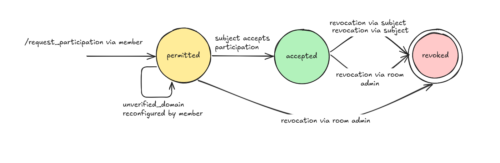

# MSC4345: Server key identity and room membership

> [!NOTE]
>
> This proposal is a parallel exploration of
> [MSC4243: User ID localparts as Account Keys](https://github.com/matrix-org/matrix-spec-proposals/pull/4243),
> in order to explore the security of the Matrix room model with respect to new
> identities.

## Server identity today

Events in Matrix are signed by the sending server's domain-scoped signing key,
which is also a rotating key. During signature verification, a server must
obtain the public key used to sign an event. This presents problems when the
origin server is offline or has been decommissioned. As this forces servers to
rely on notaries to supply historical keys.

There are two major issues with this system that lead to inconsistent views of
the DAG:

- Signature verification depends on the availability of notaries to return a
  copy of each public key from servers that are currently unavailable.

- Even when notaries are available, they may never have been present in the
  rooms that a server is trying to join, and so may not have copies of relevant
  public keys. If no notary has the key history for a given server, none of the
  server's events can be verified.

There are also major infrastructure related concerns with providing notaries:

- Notaries are trusted infrastructure that can enable attackers to impersonate
  other servers.

- Decommissioning a notary has to be done responsibly with consideration to
  allow the public keys to be transferred to other notaries. Which is a process
  that also has security risks.

We identify that the reason notaries are required is because the identity of
servers is provided through their domain or server name. And that therefore
verifying authenticity of events with respect to a server's identity is a
crossed concern with verification of ownership of a server name.

## Considerations for alternative identity

The Matrix room model currently provides new identities with the same level of
access as most room members via the _default power level_. And this is what has
historically allowed malicious actors to exploit the room model with new user
identities and attack public matrix rooms

Server names as server identity provide a cost to creating a new identity. For
example an address or domain must be registered for the server. Throughout
Matrix's history, attackers have minted new user identities by exploiting
homeservers with weak registration requirements instead of minting new
homeservers. And servers using IP addresses as their server names are nearly
universally banned from public matrix rooms. Therefore the cost to creating new
server identities with server names is significant. And this cost is a
significant factor in deterring attacks that the room model is currently
vulnerable to.

Any proposal that changes the primary identity in the Matrix room model
therefore must explicitly address:

1. The level of access new identities have in the Matrix room model.
2. How room administrators can assess the trustworthiness of those identities
   before providing them access.

And this is our primary motivation for carrying out this exploration parallel to
[MSC4243: User ID localparts as Account Keys](https://github.com/matrix-org/matrix-spec-proposals/pull/4243).

## Proposal

We propose to make the server's identity within a room solely a long lived
ed25519 public key. This key is explicitly appended to the DAG via an auth
event. This event also sets the terms for routing information and the server's
participation within the room.

This has several advantages:

- The the DAG itself becomes a record of which keys were held by participants,
  which eliminates the need for notaries in public key discovery.

- Client UI associates servers with the server key, not the domain. We provide a
  friendly alternative to domain names that can be associated with the server
  key in clients as a substitution for servers with unverified domains.

- Verification of domain ownership happens subjectively at any time
  independently of the DAG. Domains are not associated with server keys and
  cannot be accessed by clients until their homeserver has independently
  verified ownership of the domain.

In addition to this, we strengthen the conditions of server participation in the
DAG:

- We also introduce server participation, which allows servers to be revoked
  access to the room at the DAG level. This allows both public and private rooms
  to benefit from DAG reproducibility and preemptive access control. Revoked
  participation forms a _casual barrier_.

- Servers are unable to participate within a room until their key has been added
  by an existing participant. This principally ensures the introduction of
  server keys is traceable to existing participants. Without this traceability,
  the ability to add an infinite number of new server keys is available
  ambiently to anyone who is able to federate with a by-standing participant or
  malicious leaky server. In addition, this provides participants that have
  invite permission the opportunity to challenge previously undiscovered
  homeservers. Whereas there is no current protocol step to enable this for
  public rooms.

We make no attempt to change the relationship of users to the DAG and servers
within this MSC.
[MSC4348: Portable and serverless accounts in rooms](https://github.com/matrix-org/matrix-spec-proposals/pull/4348)
is an MSC that does explore changing the relationship of users to servers that
builds upon this proposal. Servers still have to send events through their users
in both MSCs and we don't intend to change that in future MSCs in this series
either.

### Terminology

- A server's _ambient power level_ is the highest power level of any user that
  is resident to the server.

### The `accept` top level `m.room.power_levels` content property

This is the power level required to accept requests to participate. Defaults to
`100`.

### The `m.server.participation` state event, `state_key: ${origin_server_key}`

#### The `unverified_domain` property

This is a string representing the domain of the server. This is NOT an
attestation that ownership has been verified by the sender of the event. This
property is protected from redaction. Its primary purpose is to provide routing.

This property is not required, as it may be desirable to hide the domain when
setting the server's participation to `revoked`. Particularly in the event of
attempted impersonation, or an abusive domain name.

#### The `participation` property

`participation` can be one of `requested`, `accepted` or `revoked`.
`participation` is protected from redaction.

#### The `reason` property

An optional reason property may be present in order to explain the reason why a
server has been revoked or requested to participate.

### Participation semantics

In this section, we describe the semantics of server participation. Later, we
make an attempt of implementing these in authorization rules, but auth rules are
difficult to parse, and the intent and context of statements is lost. Where
authorization rules are inconsistent this text takes precedence.

- Reminder: In this MSC _Server_ refers to the controller of a ed25519 keypair,
  not a particular domain or deployment.

#### Requested participation

The purpose of the `requested` participation state is to always introduce the
`m.server.participation` event within a _subject controlled state_. This means
that only the controller of the keypair for which the participation describes
can set the `unverified_domain` in the event.

A secondary purpose of the `requested` participation state is to make a server's
request to participate visible to all participants within a room. This is
important in situations where a server can only request to join via a
participant which otherwise cannot permit their participation (because of the
silo'd nature of joining matrix rooms). And so the room admins can be made aware
of the request.

An `m.server.participation` event with a `requested` participation MUST be
cosigned by a previously _accepted_ participant key in order to be authorizable.
The purpose of this property is to add traceability to the origin of keys within
a room. Particularly as the ability to publish requests to participate is
available to any _accepted_ participant.

#### Accepted participation

The purpose of the `accepted` participation state is for a user with the power
level to _accept_ to be able to permit a server to begin participating in the
room.

The `unverified_domain` property SHOULD be identical to its prior value in the
preceding event with a `participation` of `requested`. And this is enforced by
authorization rules.

#### Revoked participation

The purpose of the `revoked` participation state is to signal that the key can
no longer be used to authorize events within the room. This can be both from a
loss of control from the key controller or because of an intervention by the
server admins for moderation purposes. Once a key is revoked, if a Matrix
homeserver is to participate again it must rejoin the room with a new keypair.

A key controller can revoke their own key at any time.

A user with the _accept_ power level may change the _participation_ of any
server to `revoked` when the server has less ambient power level than the user
making the revocation. This power level comparison is the sending user's power
level compared to the revoked server's ambient power level.

#### Situations where `m.server.participation` is sent on behalf of the server

There are two situations where the `m.server.participation` event is sent by a
matrix user on behalf of a server. In both situations, the event can be sent by
any localpart, regardless of room membership:

- A new server requests to participate in the room via an existing server with a
  _participation_ of _accepted_.
- A key controller revokes their own key.

#### Room creation flow

After creating the room, and before sending the room creator's `m.room.member`
event, the room creator's origin server should immediately set its own
_participation_ via the room creator's account to `accepted`, including the
advertised `unverified_domain` property of their participation event.

#### Room join flow

In order to join a room, the `/request_participation` endpoint is used to first
ensure that a participation event exists in the room for the joining server's
public key.

The joining server uses the response from this endpoint to create a
`participation` event that sets the current participation to `accepted`. The
joining server should also set the `unverified_domain` that they are advertising
their public key from.

Servers MUST accept or revoke their own participation before emitting any events
to the room. This is enforced by authorization rules.

#### Room invitation flow

Invitations are sent as normal, but in order to accept an invitation and join
the invited user, the invited user's server must first request to participate
within the room if their server does not already have a `participation` of
`accepted`.

Servers can only accept invitations and emit a join event when their current
participation state in the room is set to `accepted`.

### Key revocation

We define a _key revocation event_ to be an `m.server.participation` event with
the following properties:

1. The event's signature can be verified with the key found in the `state_key`.
2. The event's `participation` is `revoked`.

Key revocations are enforced by auth rules to be immutable.

### The `m.server.participation` authorization rule

These rules are to be inserted before rule 4 in
[version 12](https://spec.matrix.org/v1.10/rooms/v11/#authorization-rules), the
check for `m.room.member`.

1. If type is `m.server.participation`:
   1. If the sender's signature matches the `state_key` of the considered event:
      1. If there is no current `participation` for the public key within
         `state_key`:
         1. If the `participation` field of the considered event is `accepted`
            AND the sender is a room creator, allow[^room-creator].
         2. If the `participation` field of the considered event is not
            `requested`, reject.
         3. If there is no current `participation` for the key contained within
            `request_authorised_via_server` with a participation of `accepted`,
            reject.
         4. If there is no signature on the considered event for the key
            contained within `request_authorised_via_server`, reject.
         5. Otherwise, reject.
      2. If the `participation` field of the considered event is `revoked` AND
         the current participation is not `revoked`, allow.
      3. Otherwise, reject.
   2. If `participation` is `revoked`:
      1. If the origin of the current participation state is the target key,
         reject[^revocation].
      2. If the `sender`'s power level is greater than or equal to the _accept
         level_, is greater than or equal to the target server's ambient power
         level, allow.
   3. If `participation` is `accepted`:
      1. If the _target server_'s current participation state is `accepted`,
         reject.
      2. If the _target server_'s current participation state is `revoked`,
         reject[^revocation].
      3. If the `sender`'s power level is greater than or equal to the _accept
         level_, allow.
   4. Otherwise, reject.

2. If the `sender`'s current participation state is not `accepted`, reject.

[^room-creator]:
    This rule allows the room creator to set their own participation.

[^participation-accept]:
    This rule prevents anyone but the owner of the key from setting the
    participation to accept

[^revocation]:
    This rule enforces that any controller of the key has total autonomy over
    its revocation. Room admins cannot steal a key and override this, once the
    key is revoked, it has been permanently revoked.

### The request participation handshake

This handshake is largely the same as the make join and make knock handshake,
but in the room versions that support server participation it is general to both
situations, and supersedes their use. Joins and knocks can be sent directly
where the server already has a _participation_ of _accepted_.

#### GET `/_matrix/federation/v1/make_participation/{roomId}/{userId}`

This endpoint is identical to `make_join` except for the following:

- The requested server should respond with 403 if:
  - The user is banned.
  - If the user has not received an invitation when the join rule is `invite`.

#### GET `/_matrix/federation/v1/send_participation/{roomId}/{userId}`

This endpoint is identical to `send_join` except for the following:

- The resident server MUST verify that the `m.server.participation` event is
  signed using the same server key found in the `state_key`.

- The resident server SHOULD verify that the requesting server is claiming
  ownership of the provided server key in the `m.server.participation` event.

- The resident server SHOULD verify that the origin of the request is in control
  of the `unverified_domain`.

- The resident server MUST add its own signature to the event using the key
  matching the property `request_authorised_via_server` within the
  `m.server.participation` event before sending or persisting the event to toher
  servers.

- The endpoint submits a signed `m.server.participation` event to the resident
  server for it to accept into the room's graph.

### Introducing `/_matrix/key/v3/query`

`valid_until_ts` is removed. Keys are never time-bounded and revocation is
explicit via DAG state.

To verify domain ownership from an `m.server.participation` event:

1. The event must contain an `unverified_domain` property.
2. The event must be signed with the private key associated with the public key
   found in the state_key (auth rules also enforce the state key is consistent
   with the origin server key).
3. The same public key is advertised in `/_matrix/key/v3/query` when requested
   from the `unverified_domain`

The server that performed verification of domain ownership may now cache the
mapping. But may not wish to do so permanently, as the keys may be stolen or
revoked in the future.

The requested server should make sure to only admit ownership of keys for which
the requesting server can access through participation within a room where the
requested server is using said keys. In order to not leak information about the
server's participation within a room.

### Changes to the user ID format

- User ID _server name_'s are replaced with an ed25519 public key, called the
  _server key_[^msc4243-prose].

- The private key for this _server key_ signs event JSON over
  federation[^msc4243-prose].

[^msc4243-prose]:
    This wording is taken directly from MSC4243 and shaped up a little

### Impositions on Client UI

Homeserver's must verify domain ownership before events are annotated with
`unsigned.server_domain`. Clients then use this to show a user's server domain
user ID rather than a user's server key user ID. Clients should never use the
`m.server.participation` `unverified_domain` to show the origin of events.

Clients should encode the public key for displaying unverified servers. Clients
may also highlight this by deriving a stable colour identity from the key.

Please suggest specific algorithms to make this consistent.

## Potential issues

## Alternatives

### MSC4243: User ID localparts as Account Keys

This proposal is an alternative to
[MSC4243: User ID localparts as Account Keys](https://github.com/matrix-org/matrix-spec-proposals/pull/4243)
and borrows several ideas from the same proposal. It is not required reading.
The key difference between these proposals is that this proposal describes long
lived identity for servers as a key pair in Matrix rooms. Whereas MSC4243 only
does so for individual user accounts.

However, critically this MSC provides traceability to the origin of users,
whereas MSC4243 does not unless a policy server is in use to sign each event.

### MSC4124: Simple Server Authorization

This proposal borrows the principle of constrained server membership from
MSC4124. Specifically changing authorization to stop un-encountered servers from
suddenly appending an infinite amount of data to the DAG.

### MSC4104: Auth Lock: Soft-failure-be-gone!

This proposal encodes a special auth rule for `revoked` participation to avoid
soft failure and the problems discussed in MSC4104.

## Security considerations

See [Impositions on client UI](#impositions-on-client-ui).

### Why server bans are implemented as key revocation

It's not clear whether Matrix will be able to prevent room admins becoming a
causal authority. In that instance, banning and unbanning a server can be used
to successfully use a stolen identity without the original controller being able
to stop it. See below. If banning servers is revocation, then the original key
controller can revoke their own key in any branch that the room admins try to
create where the key is still valid.

Room admins as causal authority may successfully use stolen keys to impersonate
if banning servers is not key revocation.

If a room admin steals a server key, they may still use the stolen key by
banning the server as an admin, and then use the stolen the key to add events
that are concurrent to the ban. If the room admin also serves as the causal
authority in the room, then this would allow them to fake valid events.

Without being the causal authority this attack would fail. Without the ability
to "unban" a server identity, this attack fails.

### Equivocation of revocation

Key controllers will inevitably equivocate about their current participation.
This can happen with the intention to use a stolen key, or to evade a moderation
decision made by the room admins. As of writing, this kind of equivocation is
handled locally by soft-failure.

It may be possible to strengthen the mitigation through the exploration of the
following in further MSCs:

- Constraining key controllers to produce events with an explicit backlink to a
  previous event to form a linear chain, in order to enable reasoning about a
  given key controller's causal knowledge and further:
  - Scope keys at creation to a given number of events.
  - Scope the canonical the history of the key at revocation.

- Providing a means for servers to exchange evidence of equivocation.

- Out-of-room server discovery via a gossip protocol using zero knowledge proofs
  to mitigate silo'd room participants.

- Embracing inconsistency in some scenarios over eventual consistency, keeping
  participants in an unmerged, inconsistent state when room creators have acted
  against the integrity of the room. This would also prevent _gaming_ tie breaks
  in order to reach a desired outcome over repeat attempts.

## Unstable prefix

- `m.server.participation` -> `org.matrix.msc4345.participation`
- `/_matrix/key/v3/query` => `_matrix/key/v3/org.matrix.msc4345/query`

## Dependencies

None.
