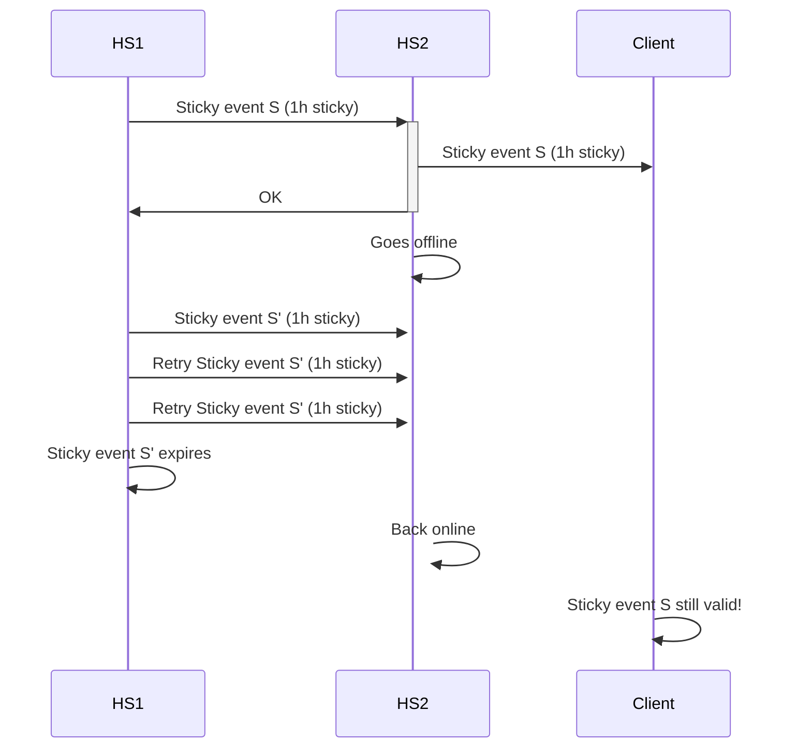

# MSC4354: Sticky Events

MatrixRTC currently relies on allowing any user (PL0) to send `org.matrix.msc3401.call`
and `org.matrix.msc3401.call.member` state events into the room
for sending per-user per-device state. MatrixRTC wants to be able to share a temporary state to all
users in a room to indicate whether the given client is in the call or not. 

The concerns with allowing any user to send room state and using it for MatrixRTC are mainly:

1. Any user can modify other user's call state. MSC3757 tries to fix this, but in order to ensure other
   users are unable to modify each other’s state, it proposes using string packing for authorization which
   feels wrong, given the structured nature of events.  
2. Allowing unprivileged users to send arbitrary amounts of state into the room is a potential
   abuse vector, as these states can pile up and can never be cleaned up as the DAG is append-only.  
3. State resolution can cause rollbacks. These rollbacks may inadvertently affect per-user per-device state.

[MSC3489](https://github.com/matrix-org/matrix-spec-proposals/pull/3489) ("Sharing streams of location
data with history", AKA "live location sharing") has similar problems: it uses state events when it
really just needs per-user last-write-wins behaviour.

There currently exists no good communication primitive in Matrix to send this kind of data. Receipt/Typing EDUs are
almost the right primitive, but:

* They aren't extensible. You can _only_ send receipts / typing notifications and cannot add extra keys to the JSON object.
  There is no concept of EDUs in the Client-Server API to allow additional EDU types, though
  [MSC2477](https://github.com/matrix-org/matrix-spec-proposals/pull/2477) tries to change that. 
* They do not guarantee delivery. Receipts/typing have slightly different persistence/delivery guarantees,
  all of which currently fall short of guaranteeing delivery. You _can_ guarantee delivery with EDUs, which is what to-device messages
  do, but that lacks the per-room scoping required for a per-room, per-user state. It's insufficient to just slap on some extra
  keys to make it per-room, per-user though because of the Byzantine broadcast problem: a user can send each server _different_
  state, thus breaking convergence. To-device messages fundamentally avoid this by being point-to-point communication, and not
  a broadcast mechanism.

This proposal adds such a primitive, called Sticky Events, which provides the following guarantees:

* Eventual delivery (with timeouts) with convergence.  
* Access control tied to the joined members in the room.  
* Extensible, able to be sent by clients.

This new primitive can be used to implement MatrixRTC participation and live location sharing, among other functionality.

## Proposal

Message events can be annotated with a new top-level `sticky` object[^toplevel], which MUST have a `duration_ms`,
which is the number of milliseconds for the event to be sticky. The presence of `sticky.duration_ms`
with a valid value makes the event “sticky”[^stickyobj]. Valid values are the integer range 0-3600000 (1 hour).
For use cases that require stickiness beyond this limit, the application is responsible for sending another
event to make it happen. The `sticky` key is not protected from redaction. A redacted sticky event is the same
as a normal event. Note: this new top-level object is added to the [`ClientEvent` format](https://spec.matrix.org/v1.16/client-server-api/#room-event-format)
and the [`Persistent Data Unit`](https://spec.matrix.org/v1.16/rooms/v12/#event-format-1) for each room version.

```json
{
    "type": "m.rtc.member",
    "sticky": {
        "duration_ms": 600000
    },
    "sender": "@alice:example.com",
    "room_id": "!foo",
    "origin_server_ts": 1757920344000,
    "content": { ... }
}
```

This key can be set by clients in the CS API by a new query parameter `sticky_duration_ms`, which is
added to the following endpoints:

* [`PUT /_matrix/client/v3/rooms/{roomId}/send/{eventType}/{txnId}`](https://spec.matrix.org/v1.16/client-server-api/#put_matrixclientv3roomsroomidsendeventtypetxnid)
* [`PUT /_matrix/client/v3/rooms/{roomId}/state/{eventType}/{stateKey}`](https://spec.matrix.org/v1.16/client-server-api/#put_matrixclientv3roomsroomidstateeventtypestatekey)

To calculate if any sticky event is still sticky:

* Calculate the start time:  
  * The start time is `min(received_ts, origin_server_ts)`. This ensures that malicious origin timestamps cannot
    specify start times in the future.  
* Calculate the end time as `start_time + min(sticky_duration_ms, 3600000)`.  
* If the end time is in the future, the event remains sticky.

Sticky events are like normal message events and are authorised using normal PDU checks. They have the
following _additional_ properties[^prop]:

* They are eagerly **pushed** to all other servers.[^partial]  
* They must be **delivered** to clients.[^sync]
* Only state event level **checks** are applied to them.[^softfail][^hisvis]

To implement these properties, servers MUST:

* Attempt to **push** their own[^origin] sticky events to all joined servers, whilst respecting per-server backoff times.
  Large volumes of events to send MUST NOT cause the sticky event to be dropped from the send queue on the server.
* When a new server joins the room, existing servers MUST attempt to **push** all of their own sticky events[^newjoiner].
* Ensure sticky events are **delivered** to clients via `/sync` in a new section of the sync response,
  regardless of whether the sticky event falls within the timeline limit of the request.
  If there are too many sticky events to deliver at once, they will be delivered in subsequent `/sync` responses instead.
* Soft-failure **checks** MUST be re-evaluated when the membership state changes for a user with unexpired sticky events.[^softfail]
* History visibility **checks** MUST NOT be applied to sticky events. Any joined user is authorised to see sticky events
  for the duration they remain sticky.[^hisvis]

When an event loses its stickiness, these properties disappear with the stickiness. Servers SHOULD NOT
eagerly synchronise such events anymore, nor send them down `/sync`, nor re-evaluate their soft-failure status.
Note: policy servers and other similar antispam techniques still apply to these events.

These messages may be combined with [MSC4140: Delayed Events](https://github.com/matrix-org/matrix-spec-proposals/pull/4140)
to provide heartbeat semantics (e.g required for MatrixRTC). Note that the sticky duration in this proposal
is distinct from that of delayed events. The purpose of the sticky duration in this proposal is to ensure sticky events are cleaned up,
whereas the purpose of delayed events is to affect the send time (and thus start time for stickiness) of an event.

### Sync API changes

The new `/sync` section looks like:

```js
{
  "rooms": {
    "join": {
      "!726s6s6q:example.com": {
        "account_data": { ... },
        "ephemeral": { ... },
        "state": { ... },
        "timeline": { ... },
        "sticky": {
            "events": [
                {
                    "sender": "@bob:example.com",
                    "type": "m.foo",
                    "sticky": {
                      "duration_ms": 300000
                    },
                    "origin_server_ts": 1757920341020,
                    "content": { ... },
                    "unsigned": { "sticky_duration_ttl_ms": 258113 }
                },
                {
                    "sender": "@alice:example.com",
                    "type": "m.foo",
                    "sticky": {
                      "duration_ms": 300000
                    },
                    "origin_server_ts": 1757920344000,
                    "content": { ... }
                    "unsigned": { "sticky_duration_ttl_ms": 289170 }
                }
            ]
        }
      }
    }
  }
}
```
Sticky messages MAY be sent in the timeline section of the `/sync` response, regardless of whether
or not they exceed the timeline limit[^ordering]. If a sticky event is in the timeline, it MAY be
omitted from the `sticky.events` section. This ensures we minimise duplication in the `/sync` response JSON.
This proposal recommends always putting sticky events into the `sticky.events` section _except_ if
the sticky event is going to be returned in the `timeline.events` section of the current sync response.
In other words, filter out any event from `sticky.events` where the event ID appears in `timeline.events`. 

Sticky events follow the same 'stream-like' behaviour as the `timeline`. This means clients will receive a sticky
event S _once_, and subsequent requests with an advanced `since` token will not return the same sticky event S.

When sending sticky events down `/sync`, the `unsigned` section SHOULD have a `sticky_duration_ttl_ms` to indicate
how many milliseconds until the sticky event expires. This provides a way to reduce clock skew between a local homeserver
and their connected clients. Clients SHOULD use this value to determine when the sticky event expires.

Over Simplified Sliding Sync, Sticky Events have their own extension `sticky_events`, which has the following request extension
shape:

```js
{
  "enabled": true,
  "limit": 100, // optional (default 100, min 1): max number of events to return, server can override to a lower number
  "since": "some_token" // optional: can be omitted on initial sync / when extension is only just enabled
}
```

and, when enabled, the following response extension shape:

```js
{
  "next_batch": "some_token", // REQUIRED when there are changes
  "rooms": {
      "!726s6s6q:example.com": {
          "events": [{
              "sender": "@bob:example.com",
              "type": "m.foo",
              "sticky": {
                "duration_ms": 300000
              },
              "origin_server_ts": 1757920344000,
              "content": { ... }
          }]
      }
  }
}
```

Sticky events are expected to be encrypted and so there is no [state filter](https://spec.matrix.org/v1.16/client-server-api/#post_matrixclientv3useruseridfilter_request_roomeventfilter)
equivalent provided for sticky events e.g to filter sticky events by event type.
As with normal events, sticky events sent by ignored users MUST NOT be delivered to clients.

#### Pagination

Because sticky events and to-device messages are alike in the way that they should be *reliably* delivered to
clients, without any gaps in the pagination, they follow the [MSC3885: Sliding Sync Extension: To-Device messages][MSC3885]
model for pagination in sliding sync.

In short: when there are too many sticky events to return in one response, the server returns a limited number
of the oldest sticky events that have not yet been delivered.

At every response, the server returns a `next_batch` token which the client MUST persist and send
as a `since` token in the next Sliding Sync request (in the extension), if the client wishes to advance
in the sticky events stream.

However, we don't require `next_batch` to be provided in the response when there are no changes, because that seems
like a mistake, which would lead to unnecessarily high quiescent bandwidth usage if many extensions follow this pattern.
[There is a comment thread open on MSC3885.](https://github.com/matrix-org/matrix-spec-proposals/pull/3885#discussion_r2623950713).

One concern is that [MSC3885] has not yet been updated to account for [MSC4186 'Simplified' Sliding Sync][MSC4186],
the 'modern-day' dialect of Sliding Sync, so it is unknown whether this pattern will remain in use.
Whatever happens, this MSC should likely follow the same evolution as that one.

[MSC3885]: https://github.com/matrix-org/matrix-spec-proposals/pull/3885
[MSC4186]: https://github.com/matrix-org/matrix-spec-proposals/pull/4186

Another concern is a potential problem that we are calling 'flickering'.
This is where due to oldest-first pagination, a client might briefly display stale data before
near-immediately updating it with later data, despite that later data already having been 'available'
on the server.

With that said, given this is an edge case that requires a substantial number of sticky events to trigger,
we don't currently consider it worthwhile to add complexity to avoid.

### Rate limits

As sticky events are sent to clients regardless of the timeline limit, care needs to be taken to ensure
that other room participants cannot send large volumes of sticky events.

Servers SHOULD rate limit sticky events over federation. Servers can choose one of two options to do this:
 - A) Do not persist the sticky events and expect the other server to retry later.
 - B) Persist the sticky events but wait a while before delivering them to clients.

Option A means servers don't need to store sticky events in their database, protecting disk usage at the cost of more bandwidth.
To implement this, servers MUST return a non-2xx status code from `/send` such that the sending server
*retries the request* in order to guarantee that the sticky event is eventually delivered. Servers MUST NOT
silently drop sticky events and return 200 OK from `/send`, as this breaks the eventual delivery guarantee.
Care must be taken with this approach as all the PDUs in the transaction will be retried, even ones for different rooms / not sticky events.
Servers solely relying on this option will need to consider that sticky events may be transitively delivered by a 3rd server.

Option B means servers have to store the sticky event in their database, protecting bandwidth at the cost of more disk usage.
This provides fine-grained control over when to deliver the sticky events to clients as the server doesn't need
to wait for another request. Servers SHOULD deliver the event to clients before the sticky event expires. This may not
always be possible if the remaining time is very short.

### Federation behaviour

As with regular events, servers are only responsible for sending sticky events originating from their own server. This ensures the server is aware
of the `prev_events` of all sticky events they send to other servers. This is important because the receiving server will
attempt to fetch those previous events if they are unaware of them, _rejecting the transaction_ if the sending server fails
to provide them. For this reason, it is not possible for servers to reliably deliver _other server's_ sticky events.

In the common case, sticky events are sent over federation like any other event and do not cause any behavioural changes.
The two cases where this is different is:
 - when sending sticky events to newly joined servers
 - when sending "old" but unexpired sticky events

Servers tend to maintain a sliding window of events to deliver to other servers e.g the most recent 50 PDUs. Sticky events
can fall outside this range, which is what we define as "old". On the receiving server, old events appear to have unknown
`prev_events`, which cannot be connected to any known part of the room DAG. Sending sticky events to newly joined servers can be seen
as a form of sending old but unexpired sticky events, and so this proposal only considers this case.

Servers MUST send old sticky events in the order they were created on the server (stream ordering / based on `origin_server_ts`).
This ensures that sticky events appear in roughly the right place in the timeline as servers use the arrival ordering to determine
an event's position in the timeline.

Sending these old events will potentially increase the number of forward extremities in the room for the receiving server. This may impact state resolution
performance if there are many forward extremities. Servers MAY send dummy events to remove forward extremities (Synapse has the
option to do this since 2019). Alternatively, servers MAY choose not to add old sticky events to their forward extremities, but
this A) reduces eventual delivery guarantees by reducing the frequency of transitive delivery of events, B) reduces the convergence
rate when implementing ephemeral maps (see "Addendum: Implementing an ephemeral map"), as that relies on servers referencing sticky
events from other servers.

## Potential issues

### Time

Servers who can’t maintain correct clock frequency may expire sticky events at a slightly slower/faster rate
than other servers. As the maximum timeout is relatively low, the total deviation is also reasonably low,
making this less problematic. The alternative of explicitly sending an expiration event would likely cause
more deviation due to retries than deviations due to clocks.

Servers with significant clock skew may set `origin_server_ts` too far in the past or future. If the value
is too far in the past this will cause sticky events to expire quicker than they should, or to always be
treated as expired. If the value is too far in the future, this has no effect as it is bounded by the current time.
As such, this proposal relies somewhat on NTP to ensure clocks over federation are roughly in sync.
As a consequence of this, the sticky duration SHOULD NOT be set to below 5 minutes.[^ttl] 

### Encryption

Encrypted sticky events reduce reliability as in order for a sticky event to be visible to the end user it
requires *both* the sending client to think the receiver is joined (so we encrypt for their devices) and the
receiving server to think the sender is joined (so it passes auth checks). Unencrypted events only strictly
require the receiving server to think the sender is joined.

The lack of historical room key sharing may make some encrypted sticky events undecryptable when new users join the room. 
[MSC4268: Sharing room keys for past messages](https://github.com/matrix-org/matrix-spec-proposals/pull/4268) would
help with this.

### Spam

Servers may send every event as a sticky event, causing a higher amount of events to be sent eagerly over federation
and to be sent down `/sync` to clients. The former is already an issue as servers can simply `/send` many events.
The latter is a new abuse vector, as up until this point the `timeline_limit` would restrict the amount of events
that arrive on client devices (only state events are unbounded and setting state is a privileged operation). Even so,
if a client was actively syncing then they would see all these events anyway, so it's only really a concern for "gappy"
incremental syncs when the client was not actively syncing and has now started their application. This proposal has the
following protections in place:

* All sticky events expire, with a hard limit of 1 hour. The hard limit ensures that servers cannot set years-long expiry times.
  This ensures that the data in the `/sync` response can go down and not grow unbounded.  
* All sticky events are subject to normal PDU checks, meaning that the sender must be authorised to send events into the room.  
* Servers sending lots of sticky events may be asked to try again later as a form of rate-limiting.
  Due to data expiring, subsequent requests will gradually have less data.


## Alternatives

### Use state events

We could do [MSC3757](https://github.com/matrix-org/matrix-spec-proposals/pull/3757), but for the
reasons mentioned at the start we don’t really want to do so.

### Make stickiness persistent not ephemeral

There are arguments that, at least for some use cases, we don’t want these sticky events to timeout.
However, that opens the possibility of bloating the `/sync` response with sticky events.

Suggestions for minimizing that have been to have a hard limit on the number of sticky events a user can have per room,
instead of a timeout. However, this has two drawbacks: a) you still may end up with substantial bloat as stale data doesn’t
automatically get reaped (even if the amount of bloat is limited), and b) what do clients do if there are already too many
sticky events? The latter is tricky, as deleting the oldest may not be what the user wants if it happens to be not-stale data,
and asking the user what data it wants to delete vs keep is unergonomic.

Non-expiring sticky events could be added later if the above issues are resolved.

### Have a dedicated ‘ephemeral user state’ section

Early prototypes of this proposal devised a key-value map with timeouts maintained over EDUs rather than PDUs.
This early proposal had a similar overall feature set as this proposal but with two differences:
 - The early proposal never persisted anything, whereas this one persists by default to the DAG (which could be deleted via message retention).
   Some use cases would like to have persistence.
 - The lack of any persistence enabled equivocation attacks.

Servers could broadcast different values for the same key to different servers, causing the map to not converge:
the Byzantine Broadcast problem. Matrix already has a data structure to agree on shared state: the room DAG.
As such, this led to the prototype to the current proposal. By putting the data into the DAG, other servers
can talk to each other via it to see if they have been told different values. When combined with a simple
conflict resolution algorithm (which works because there is [no need for coordination](https://arxiv.org/abs/1901.01930)),
this provides a way for clients to agree on the same values. Note that in practice this needs servers to *eagerly*
share forward extremities so servers aren’t reliant on unrelated events being sent in order to check for equivocation.
Currently, there is no mechanism for servers to express “these are my latest events, what are yours?” without actually sending another event.

## Security Considerations

Servers may equivocate over federation and send different events to different servers in an attempt to cause
the key-value map maintained by clients to not converge. Alternatively, servers may fail to send sticky events
to their own clients to produce the same outcome. Federation equivocation is mitigated by the events being
persisted in the DAG, as servers can talk to each other to fetch all events. There is no way to protect against
dropped updates for the latter scenario.

Servers may lie to their own clients about the `unsigned.sticky_duration_ttl_ms` value, with the aim of making
certain sticky events last longer or shorter than intended. Servers can already maliciously drop sticky events
to lose updates, and the lack of any verification of the event hash means servers can also maliciously alter the
`origin_server_ts`. Therefore, adding `unsigned.sticky_duration_ttl_ms` doesn't materially make the situation worse.
In the common case, it provides protection against clock skew when clients have the wrong time. 

## Unstable Prefix

- The `sticky_duration_ms` query param is `org.matrix.msc4354.sticky_duration_ms`.
- The `sticky` key in the PDU is `msc4354_sticky`.
- The `/sync` response section is `msc4354_sticky`.
- The sticky key in the `content` of the PDU is `msc4354_sticky_key`.
- To enable this in SSS, the extension name is `org.matrix.msc4354.sticky_events`.
- The `unsigned.sticky_duration_ttl_ms` field is `unsigned.msc4354_sticky_duration_ttl_ms`

The `/versions` response in the CSAPI includes:
```json
{
    "versions": ["..."],
    "unstable_features": {
        "org.matrix.msc4354": true
    }
}
```

## Addendum

This section explains how sticky events can be used to implement a short-lived, per-user, per-room key-value store.
This technique would be used by MatrixRTC to synchronise RTC members, and should land in the spec as a suggested algorithm to follow.

### Implementing an ephemeral map

MatrixRTC relies on a per-user, per-device map of RTC member events. To implement this, this MSC proposes
a standardised mechanism for determining keys on sticky events, the `content.sticky_key` property:

```js
{
    "type": "m.rtc.member",
    "sticky": {
        "duration_ms": 300000
    },
    "sender": "@alice:example.com",
    "room_id": "!foo",
    "origin_server_ts": 1757920344000,
    "content": {
        "sticky_key": "LAPTOPXX123",
        ...
    }
}
```

`content.sticky_key` is ignored server-side[^encryption] and is purely informational. Clients which
receive a sticky event with a `sticky_key` SHOULD keep a map with keys determined via the 4-uple[^3uple]
`(room_id, sender, type, content.sticky_key)` to track the current values in the map. Nothing stops
users sending multiple events with the same `sticky_key`. To deterministically tie-break, clients which
implement this behaviour MUST[^maporder]:

- pick the one with the highest `origin_server_ts + sticky.duration_ms` (last to expire wins),  
- tie break on the one with the highest lexicographical event ID (A < Z).

>[!NOTE]
> If a client sends two sticky events in the same millisecond, the 2nd event may be replaced by the 1st if
> the event ID of the 1st event has a higher lexicographical event ID. To protect against this, clients should
> ensure that they wait at least 1 millisecond between sending sticky events with the same `sticky_key`.

Clients SHOULD expire sticky events in maps when their stickiness ends. They should use the algorithm described in this proposal
to determine if an event is still sticky. Clients may diverge if they do not expire sticky events as in the following scenario:


There is no mechanism for sticky events to expire earlier than their timeout value. To remove entries in the map, clients SHOULD
send another sticky event with just `content.sticky_key` set, with all the other application-specific fields omitted. Redacting
sticky events are an alternative way to do this, although this loses the `content.sticky_key` property so clients will need to
remember the sticky event ID to know which sticky key was affected.

When clients create multiple events with the same `sticky_key`, they SHOULD use the same sticky duration as the previous
sticky event to avoid clients not applying more recent sticky events.
```
Event        Lifetime
  S       [=========|==]  |
  S'           [====|=====|=]
                    |     |
                    A     B
```
At the time `A`, the possible states on clients is `{ _, S, S'}` where `_` is nothing due to not seeing either event. At time `B`,
the possible states on clients is `{ _, S'}`.
Contrast with:
```
Event        Lifetime
  S       [=======|====|=]
  S'           [==|=]  |
                  |    |
                  A    B
```
Just like before, at time `A` the possible states are `{ _, S, S'}`, but now at time `B` the possible states are `{ _, S }`.
This is problematic if you're trying to agree on the "latest" values, like you would in a k:v map. Note that if a client had
seen S then sees S', they will ignore it due to it having a lower expiry time than S (last to expire wins).

Note that encrypted sticky events will encrypt some parts of the 4-uple. An encrypted sticky event only exposes the room ID and sender to the server:

```js
{
  "content": {
	"algorithm": "m.megolm.v1.aes-sha2",
	"ciphertext": "AwgCEqABubgx7p8AThCNreFNHqo2XJCG8cMUxwVepsuXAfrIKpdo8UjxyAsA50IOYK6T5cDL4s/OaiUQdyrSGoK5uFnn52vrjMI/+rr8isPzl7+NK3hk1Tm5QEKgqbDJROI7/8rX7I/dK2SfqN08ZUEhatAVxznUeDUH3kJkn+8Onx5E0PmQLSzPokFEi0Z0Zp1RgASX27kGVDl1D4E0vb9EzVMRW1PrbdVkFlGIFM8FE8j3yhNWaWE342eaj24NqnnWJ5VG9l2kT/hlNwUenoGJFMzozjaUlyjRIMpQXqbodjgyQkGacTEdhBuwAQ",
	"device_id": "AAvTvsyf5F",
	"sender_key": "KVMNIv/HyP0QMT11EQW0X8qB7U817CUbqrZZCsDgeFE",
	"session_id": "c4+O+eXPf0qze1bUlH4Etf6ifzpbG3YeDEreTVm+JZU"
  },
  "origin_server_ts": 1757948616527,
  "sender": "@alice:example.com",
  "type": "m.room.encrypted",
  "sticky": {
      "duration_ms": 600000
  },
  "event_id": "$lsFIWE9JcIMWUrY3ZTOKAxT_lIddFWLdK6mqwLxBchk",
  "room_id": "!ffCSThQTiVQJiqvZjY:matrix.org"
}
```

The decrypted event would contain the `type` and `content.sticky_key`.

#### Spam

Under normal circumstances for the MatrixRTC use case there will be a window of time where clients will receive
sticky events that are not useful. MatrixRTC defines an `m.rtc.member` event with an empty content (and optional `leave_reason`)
as having [left the session](https://github.com/matrix-org/matrix-spec-proposals/blob/toger5/matrixRTC/proposals/4143-matrix-rtc.md#leaving-a-session).
This is conceptually the same as deleting a key from the map. However, as the server is unaware of the `sticky_key`, it
cannot perform the delete operation for clients, and will instead send the empty content event down `/sync`. This means if
N users leave a call, there will be N sticky events present in `/sync` for the sticky duration specified.

This is the tradeoff for providing the ability to encrypt sticky events to reduce metadata visible to the server. It's worth
noting that this increase in inactionable sticky events only applies in a small time window. Had the client synced earlier when the
call was active, then the `m.rtc.member` events would be actionable. Had the client synced later when the inactionable sticky events
had expired, then the client wouldn't see them at all.

#### Access control

If a client wishes to implement access control in this key-value map based on the power levels event,
they must ensure that they accept all writes in order to ensure all clients converge. For an example
where this goes wrong if you don't, consider the case where two events are sent concurrently:
 - Alice sets a key in this map which requires PL100,
 - Alice is granted PL100 from PL0.

If clients only update the map for authorised actions, then clients which see Alice setting a key before the
PL event will not update the map and hence forget the value. Clients which see the PL event first would then
accept Alice setting the key and the net result is divergence between clients. By always updating the map even
for unauthorised updates, we ensure that the arrival order doesn't affect the end result. Clients can then
choose whether or not to materialise/show/process a given key based on the current PL event.

[^toplevel]: This has to be at the top-level as we want to support _encrypted_ sticky events, and therefore metadata the server
needs cannot be within `content`.
[^stickyobj]: The presence of the `sticky` object alone is insufficient.  
[^prop]: An interesting observation is that these additional properties are entirely to handle edge cases. In the happy case,
events _are sent_ to others over federation, they _aren't_ soft-failed and they _do appear_ down `/sync`. This MSC just makes this
reliable. These properties are also properties which _state events_ already have, so we need the equivalent functionality if this
proposal wants to replace [MSC3757: Restricting who can overwrite a state event](https://github.com/matrix-org/matrix-spec-proposals/pull/3757).
[^partial]: Over federation, servers are not required to send all timeline events to every other server.
Servers mostly lazy load timeline events, and will rely on clients hitting `/messages` which in turn
hits`/backfill` to request events from federated servers.  
[^sync]: Normal timeline events do not always appear in the sync response if the event is more than `timeline_limit` events away.  
[^softfail]: Not all servers will agree on soft-failure status due to the check considering the “current state” of the room.
To ensure all servers agree on which events are sticky, we need to re-evaluate this rule when the current room state changes.
This becomes particularly important when room state is rolled back. For example, if Charlie sends some sticky event E and
then Bob kicks Charlie, but concurrently Alice kicks Bob then whether or not a receiving server would accept E would depend
on whether they saw “Alice kicks Bob” or “Bob kicks Charlie”. If they saw “Alice kicks Bob” then E would be accepted. If they
saw “Bob kicks Charlie” then E would be rejected, and would need to be rolled back when they see “Alice kicks Bob”.
[^hisvis]: This ensures that newly joined servers can see sticky events sent from before they were joined to the room, regardless
of the history visibility setting. This matches the behaviour of state events.
[^origin]: That is, the domain of the sender of the sticky event is the sending server.
[^newjoiner]: We restrict delivery of sticky events to ones sent locally to reduce the number of events sent on join. If
we sent all active sticky events then the number of received events by the new joiner would be `O(nm)` where `n` = number of joined servers,
`m` = number of active sticky events.
[^ordering]: Sticky events expose gaps in the timeline which cannot be expressed using the current sync API. If sync used
something like [stitched ordering](https://codeberg.org/andybalaam/stitched-order)
or [MSC3871](https://github.com/matrix-org/matrix-spec-proposals/pull/3871) then sticky events could be inserted straight
into the timeline without any additional section, hence “MAY” would enable this behaviour in the future.  
[^encryption]: Previous versions of this proposal had the key be at the top-level of the event JSON so servers could
implement map-like semantics on client’s behalf. However, this would force the key to remain visible to the server and
thus leak metadata. As a result, the key now falls within the encrypted `content` payload, and clients are expected to
implement the map-like semantics should they wish to.  
[^ttl]: Earlier designs had servers inject a new `unsigned.ttl_ms` field into the PDU to say how many milliseconds were left.
This was problematic because it would have to be modified every time the server attempted delivery of the event to another server.
Furthermore, it didn’t really add any more protection because it assumed servers honestly set the value.
Malicious servers could set the TTL to be 0 ~ `sticky.duration_ms` , ensuring maximum divergence
on whether or not an event was sticky. In contrast, using `origin_server_ts` is a consistent reference point
that all servers are guaranteed to see, limiting the ability for malicious servers to cause divergence as all
servers approximately track NTP.
[^3uple]: Earlier versions of this proposal removed the event type and had the key be the 3-uple `(room_id, sender, content.sticky_key)`.
Conceptually, this made a per-user per-room map that looked like `Map<StickyKey, Event[Any]>`. In contrast, the 4-uple format is
`Map<EventType, Map<StickyKey, Event[EventType]>>`. This proposal has flip-flopped on 4-uple vs 3-uple because they are broadly speaking
equivalent: the 3-uple form can string pack the event type in the sticky key and the 4-uple form can loop over the outer event type map
looking for the same sticky key and apply tie-breaking rules to the resulting events. We do not have any use cases for the 3-uple form
as all use cases expect the values for a given key to be of the same type e.g `m.rtc.member`. Furthermore, it's not clear how this MSC
could safely propose a delimiter when both the event type and sticky key would be freeform unicode decided by the application. For these
reasons, this MSC chooses the 4-uple format. This makes implementing `Map<StickyKey, Event[Any]>` behaviour _slightly_ harder, and makes
implementing `Map<EventType, Map<StickyKey, Event[EventType]>>` _slightly_ easier.
[^maporder]: We determine the order based on the data in the event and not by the order of sticky events in the array returned by `/sync`.
We do this because the `/sync` ordering may not match the sending order if A) servers violate the proposal and send later events first,
B) newer sticky events are retrieved transitively from a 3rd server via `/get_missing_events` _first_, then older sticky events are sent
afterwards, C) when batches of sticky events are returned down `/sync`, newer sticky events may appear in the timeline before older sticky events are
returned via batching.
