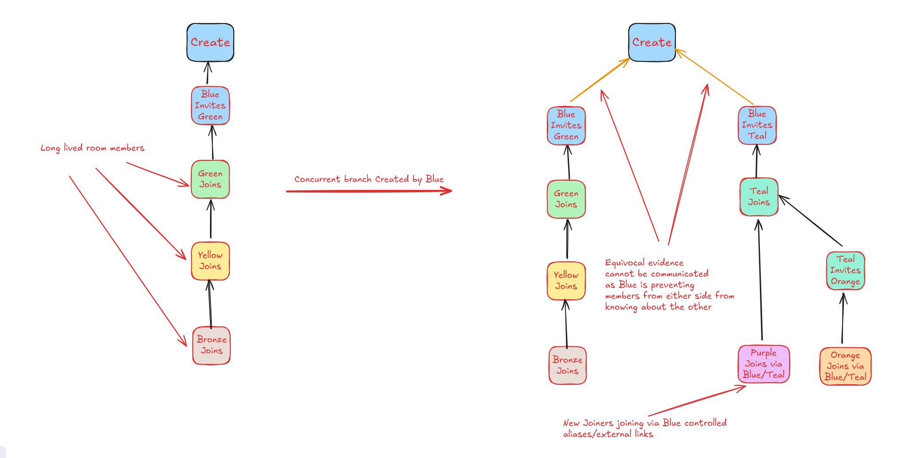

# MSC4358: Out-of-room server discovery

Currently in Matrix, it is possible for the servers which a new joiner
trusts during the join process to place the joiner into a parallel
branch that is not communicated to any other server.

Consider the following scenario:

A room has several members, Blue, Green, Yellow, and Bronze. They have
been participating for some time.

Then, the Blue decides as a room creator to create a concurrent branch
in the room that is only going to be communicated to new joiners.
Blue is also in control of the room alias, and other external links to
the room. This prevents new joiners from seeing the existing members.

## Proposal

When a server joins a room for the first time, it creates a
`room_participation_tag` for itself which is stored permanently. This
tag is derived from a hmac-sha256 of the server name and the
room_id: `hmac-sha256(server_name, room_id)`.

### The `POST /_matrix/federation/v1/discover_common_rooms` endpoint

A new endpoint is specified to allow servers to discover common rooms
without either party revealing which rooms are being queried unless
both parties have provable knowledge of the room.

For the set of rooms the requesting server is interested in,
the server creates a _room participation tag_ for each room
by taking the requested server's name and deriving a hmac-sha256 of
the _server name_ and the `room_id`: `hmac-sha256(server_name, room_id)`.

#### Request body

- The `room_participation_tags` are the tags for which the requesting
  server is asking if the requested acknowledges. This is an array of
  strings.

#### Response body

The responding server simply responds with the token tags for
which it has a match stored:

- The `recognised_tags` are any of the queried tags which the
  requested server acknowledges. This property is an array of strings.

## Potential issues

### Left/Banned members can track new members when queried

If members which have left or are banned from a room are queried about
a key from a server, then they can potentially infer that the querying
server is a member of the room.

### Useless if a victim server hasn't built up knowledge of common peers through other rooms

A server will not know which servers to query if it hasn't interacted
with any other server before through membership in other rooms.

### Not clear when it is appropriate to query common rooms

How often should rooms check for unexpected results?

When joining a new room is a good start. But how frequently otherwise?

## Alternatives

### OPRF key in the create event

An OPRF[^oprf] key could be placed into the create event which is used
instead via `OPRF(room_key, server_name)`. However, it's unclear
if there are any situations where the `room_id` is known and not
the create event.

[^oprf]: https://datatracker.ietf.org/doc/rfc9497/

## Security considerations

- None considered.

## Unstable prefix

- The endpoint `/_matrix/federation/v1/discover_common`_rooms is `/_matrix/federation/v1/org.matrix.msc4358/discover_common_rooms`

## Dependencies

- None.
