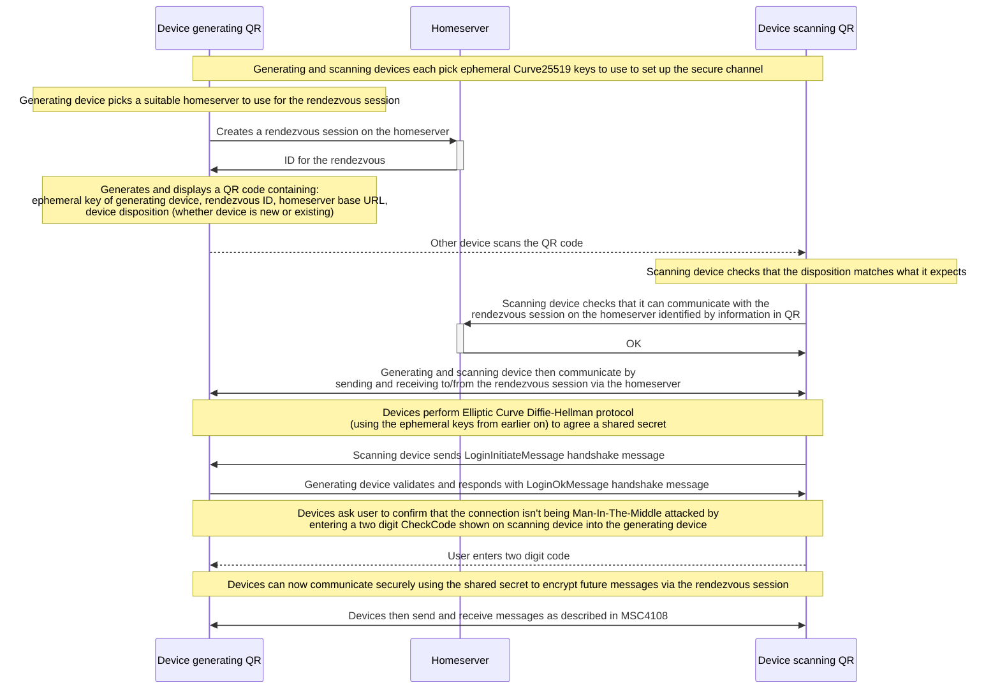
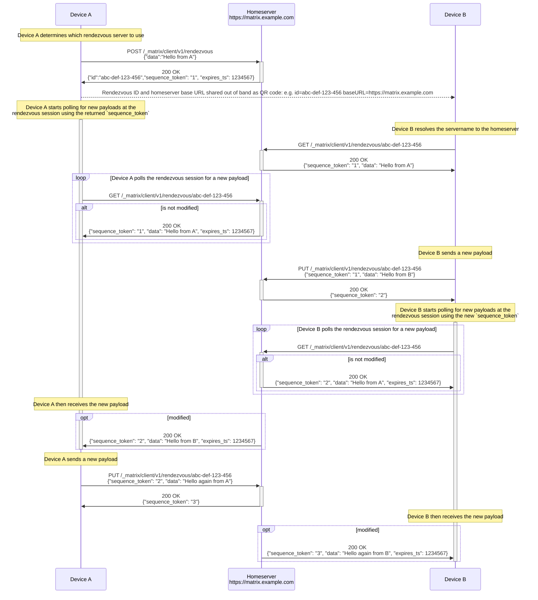
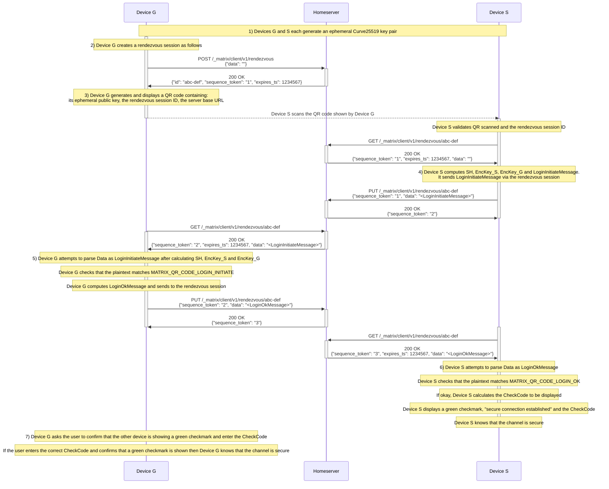

# MSC4388: Secure out-of-band channel for sign in with QR

This proposal forms part of [MSC4108] to make it easy to sign in on a new device with the help of an existing device.

It proposes a mechanism for a new an existing device to establish a secure out-of-band channel through which they can
communicate to facilitate the sign in on the new device.

Table of contents:

- [Proposal](#proposal)
- [Insecure rendezvous session](#insecure-rendezvous-session)
- [QR code format](#qr-code-format)
- [Secure channel](#secure-channel)
- [Potential issues](#potential-issues)
- [Alternatives](#alternatives)
- [Security considerations](#security-considerations)
- [Unstable prefix](#unstable-prefix)
- [Dependencies](#dependencies)

## Proposal

Depending on the pair of devices used, it may be preferable to scan the QR code on either the new or existing device,
based on the availability of a camera. As such, this proposal allows for the generation of the QR on either device.

This proposal is split into three parts:

- Creating an insecure rendezvous session on a homeserver
- Encoding the rendezvous session and an ephemeral key in a QR code
- Establishing a secure channel over the insecure rendezvous session using an ephemeral key

The overall flow looks like this:



## Insecure rendezvous session

It is proposed that an HTTP-based protocol be used to establish an ephemeral bi-directional communication session over
which the two devices can exchange the necessary data. This session is described as "insecure" as it provides no
end-to-end confidentiality nor authenticity by itself - these are layered on top of it.

New optional HTTP endpoints are to be added to the Client-Server API.

### Concept

Suppose that Device A wants to establish communications with Device B. Device A can do so by creating a
_rendezvous session_ via a `POST /_matrix/client/v1/rendezvous` call to an appropriate homeserver. Its response includes
an _rendezvous ID_ which, along with the server [base URL], should be shared out-of-band with Device B.

The rendezvous ID points to an arbitrary data resource (the "payload") on the homeserver, which is initially populated
using data from A's initial `POST` request. The payload is a string which the homeserver must enforce a maximum length on.

Anyone who is able to reach the homeserver and has the rendezvous ID - including: Device A; Device B; or a third party; -
can then "receive" the payload by polling via a `GET` request, and "send" a new a new payload by making a `PUT` request.

In this way, Device A and Device B can communicate by repeatedly inspecting and updating the payload at the rendezvous session.

### The send mechanism

Every send request MUST include an `sequence_token` value whose value is the `sequence_token` from the last `GET`
response seen by the requester. (The initiating device may also use the `sequence_token` supplied in the initial `POST` response
to immediately update the payload.) Sends will succeed only if the supplied `sequence_token` matches the server's current
revision of the payload. This prevents concurrent writes to the payload.

n.b. Once a new payload has been sent there is no mechanism to retrieve previous payloads.

### Expiry

The rendezvous session (i.e. the payload) SHOULD expire after a period of time communicated to clients via the
`expires_ts` field on the `POST` and `GET` response bodies. After this point, any further attempts to query or update
the payload MUST fail. The rendezvous session can be manually expired with a `DELETE` call to the rendezvous session.

### `POST /_matrix/client/v1/rendezvous` - Create a rendezvous session and send initial payload

Rate-limited: Yes
Requires authentication: Optional - depending on server policy

Request body is `application/json` with contents:

|Field|Type||
|-|-|-|
|`data`|required `string`|The data payload to be sent|

For example:

```http
POST /_matrix/client/v1/rendezvous HTTP/1.1
Content-Type: application/json

{
    "data": "initial data"
}
```

HTTP response codes, and Matrix error codes:

- `200 OK` - rendezvous session created
- `403 Forbidden` (`M_FORBIDDEN`) - the requester is not authorized to create the rendezvous session
- `404 Not Found` (`M_UNRECOGNIZED`) - the rendezvous API is not enabled
- `413 Payload Too Large` (`M_TOO_LARGE`) - the supplied `data` value is larger than the 4096 UTF8 character limit
- `429 Too Many Requests` (`M_LIMIT_EXCEEDED`) - the request has been rate limited

Response body for `200 OK` is `application/json` with contents:

|Field|Type||
|-|-|-|
|`id`|required `string`|Opaque identifier for the rendezvous session|
|`sequence_token`|required `string`|The token opaque token to identify if the payload has changed|
|`expires_ts`|required `integer`|The timestamp (in milliseconds since the epoch) at which the rendezvous session will expire|

Example response:

```http
HTTP 200 OK
Content-Type: application/json

{
    "id": "abcdEFG12345",
    "sequence_token": "VmbxF13QDusTgOCt8aoa0d2PQcnBOXeIxEqhw5aQ03o=",
    "expires_ts": 1662560931000
}
```

The server can chose what level of authentication is required to create a rendezvous session. Suitable policies might
include:

- Public/open - anyone can create a rendezvous session without an access token. This allows for the QR code to be
  created on either the new or existing Matrix client.
- Requires authenticated user - this would reduce abuse to known users, but would restrict the mechanism so that the QR
  code must be created on the existing Matrix client (and therefore the new Matrix client must have a camera).

The expiry time is detailed [below](#maximum-duration-of-a-rendezvous).

### `PUT /_matrix/client/v1/rendezvous/{rendezvousId}` - Send a payload to an existing rendezvous

Rate-limited: Yes
Requires authentication: No

Request body is `application/json` with contents:

|Field|Type||
|-|-|-|
|`sequence_token`|required `string`|The value of `sequence_token` from the last payload seen by the requesting device.|
|`data`|required `string`|The data payload to be sent.|

For example:

```http
PUT /_matrix/client/v1/rendezvous/abcdEFG12345 HTTP/1.1
Content-Type: application/json

{
    "sequence_token": "VmbxF13QDusTgOCt8aoa0d2PQcnBOXeIxEqhw5aQ03o=",
    "data": "new data"
}
```

HTTP response codes, and Matrix error codes:

- `200 OK` - payload updated
- `404 Not Found` (`M_NOT_FOUND`) - rendezvous session ID is not valid (it could have expired)
- `404 Not Found` (`M_UNRECOGNIZED`) - the rendezvous API is not enabled
- `409 Conflict` (`M_CONCURRENT_WRITE`, a new error code) - when the `sequence_token` does not match
- `413 Payload Too Large` (`M_TOO_LARGE`) - the supplied `data` value is larger than the 4096 UTF8 character limit
- `429 Too Many Requests` (`M_LIMIT_EXCEEDED`) - the request has been rate limited

The response body for `200 OK` is `application/json` with contents:

|Field|Type||
|-|-|-|
|`sequence_token`|required `string`|The token opaque token to identify if the payload has changed|

For example:

```http
HTTP 200 OK
Content-Type: application/json

{
    "sequence_token": "VmbxF13QDusTgOCt8aoa0d2PQcnBOXeIxEqhw5aQ03o="
}
```

### `GET /_matrix/client/v1/rendezvous/{rendezvousId}` - Receive a payload from a rendezvous session

Rate-limited: Yes
Requires authentication: No

HTTP response codes, and Matrix error codes:

- `200 OK` - payload returned
- `403 Forbidden` (`M_FORBIDDEN`) - request is not allowed due to the unsafe content policy (see below)
- `404 Not Found` (`M_NOT_FOUND`) - rendezvous session ID is not valid (it could have expired)
- `404 Not Found` (`M_UNRECOGNIZED`) - the rendezvous API is not enabled
- `429 Too Many Requests` (`M_LIMIT_EXCEEDED`) - the request has been rate limited

Response body for `200 OK` is `application/json` with contents:

|Field|Type||
|-|-|-|
|`data`|required `string`|The data payload from the last POST or PUT.|
|`sequence_token`|required `string`|The token opaque token to identify if the payload has changed|
|`expires_ts`|required `integer`|The timestamp (in milliseconds since the epoch) at which the rendezvous session will expire|

```http
HTTP 200 OK
Content-Type: application/json

{
    "data": "data from the previous POST/PUT",
    "sequence_token": "VmbxF13QDusTgOCt8aoa0d2PQcnBOXeIxEqhw5aQ03o=",
    "expires_ts": 1662560931000
}
```

To help mitigate the threat of [unsafe content](#unsafe-content), the server SHOULD inspect the `Sec-Fetch-*`
[Fetch Metadata Request Headers](https://www.w3.org/TR/fetch-metadata/) (or other suitable headers) to identify
top-level navigation requests and return a `403` HTTP response with error code `M_FORBIDDEN` instead.

A future optimisation could be allow the client to "long-poll" by sending the previous `sequence_token` as a query parameter
and then the server returns when the is new data or some timeout has passed.

### `DELETE /_matrix/client/v1/rendezvous/{rendezvousId}` - cancel a rendezvous session

Rate-limited: Yes
Requires authentication: No

HTTP response codes:

- `200 OK` - rendezvous session cancelled
- `404 Not Found` (`M_NOT_FOUND`) - rendezvous session ID is not valid (it could have expired)
- `404 Not Found` (`M_UNRECOGNIZED`) - the rendezvous API is not enabled
- `429 Too Many Requests` (`M_LIMIT_EXCEEDED`) - the request has been rate limited

### Example API usage

The actions above can be illustrated as follows:



### Implementation notes

#### Maximum payload size

The server MUST enforce a maximum payload size of 4096 UTF8 characters.

#### `sequence_token` values

The `sequence_token` values should be unique to the rendezvous session and the last modified time so that two clients can
distinguish between identical payloads sent by either client.

#### Maximum duration of a rendezvous

The rendezvous session needs to persist for the duration of the login including allowing the user another time to
confirm that the secure channel has been established and complete any extra homeserver mandated login steps such as MFA.

Clients should handle the case of the rendezvous session being cancelled or timed out by the server.

The server MUST enforce a timeout on each rendezvous. When picking a value to use:

- the minimum timeout SHOULD be 120 seconds for usability
- the maximum timeout SHOULD be 300 seconds for security

#### Choice of server

Ultimately it will be up to the Matrix client implementation to decide which rendezvous server to use.

However, it is suggested that the following logic is used by the device/client to choose the rendezvous server in order
of preference:

1. If the client is already logged in: try and use the current homeserver.
1. If the client is not logged in and it is known which homeserver the user wants to connect to: try and use that homeserver.
1. Otherwise use a default server.

### Threat analysis

#### Denial of Service attack surface

Because the rendezvous session protocol allows for the creation of arbitrary channels and storage of arbitrary data, it
is possible to use it as a denial of service attack surface.

As such, the following standard mitigations such as the following may be deemed appropriate by homeserver
implementations and administrators:

- rate limiting of requests
- limiting the number of concurrent sessions

Furthermore, this proposal limits the maximum payload size to 4KB.

#### Data exfiltration

Because the rendezvous session protocol allows for the storage of arbitrary data, it
is possible to use it to circumvent firewalls and other network security measures.

Implementation may want to block their production IP addresses from being able to make requests to the rendezvous
endpoints in order to avoid attackers using it as a dead-drop for exfiltrating data.

#### Unsafe content

Because the rendezvous session is not authenticated, it is possible for an attacker to use it to distribute malicious
content.

This could lead to a reputational problem for the homeserver domain or IPs, as well as potentially causing harm to users.

Mitigations that are included in this proposal:

- the low maximum payload size (4KB)
- payload is restricted to string
- the rendezvous session should be short-lived
- use of `Sec-Fetch-*` headers to not return payload content when browser has navigated to the session URL

## QR code format

To get a good trade-off between visual compactness and high level of error correction we use a binary mode QR with a
similar structure to that of the existing Device Verification QR code encoding described in [Client-Server
API](https://spec.matrix.org/v1.9/client-server-api/#qr-code-format).

It is proposed that the QR code format that is currently used in the Client-Server API for
[device verification](https://spec.matrix.org/v1.16/client-server-api/#qr-code-format) be extended to be more general
purpose and accommodate this new use case, and future use cases.

The "QR code version" would be repurposed to be a "QR code type" and used as the way to distinguish the format of the
subsequent data.

The existing cross verification code would be type `0x02`.  I suspect that type `0x01` and `0x00` might correspond to
earlier iterations of the cross signing flow and so might want to be "reserved".

This proposal then adds a new type `0x03`.

The QR codes to be displayed and scanned using this format will encode binary strings in the general form:

- the ASCII string `MATRIX`
- one byte indicating the QR code type: `0x03` which identifies that the QR is part of this proposal
- one byte indicating the intent of the device generating the QR:
  - `0x00` a new device wishing to login and self-verify
  - `0x01` an existing device wishing to facilitate the login of a new device and self-verify that other device
- the ephemeral Curve25519 public key that will be used for [secure channel establishment](#establishment), as 32 bytes
- the rendezvous session ID encoded as:
  - two bytes in network byte order (big-endian) indicating the length in bytes of the rendezvous session ID as a UTF-8
  string
  - the rendezvous session ID as a UTF-8 string
- the [base URL] of the homeserver for client-server connections encoded as:
  - two bytes in network byte order (big-endian) indicating the length in bytes of the base URL as a UTF-8 string
  - the base URL as a UTF-8 string

If a new version of this QR sign in capability is needed in future (perhaps with updated secure channel protocol) then
an additional type can then be allocated which would clearly distinguish this later version.

### Example for QR code generated on new device

A full example for a new device using ephemeral public key `2IZoarIZe3gOMAqdSiFHSAcA15KfOasxueUUNwJI7Ws` (base64
encoded) at rendezvous session ID `e8da6355-550b-4a32-a193-1619d9830668` on homeserver with base URL
`https://matrix-client.matrix.org` is as follows:
(Whitespace is for readability only)

```
4D 41 54 52 49 58
03 00
d8 86 68 6a b2 19 7b 78 0e 30 0a 9d 4a 21 47 48 07 00 d7 92 9f 39 ab 31 b9 e5 14 37 02 48 ed 6b
00 24
65 38 64 61 36 33 35 35 2D 35 35 30 62 2D 34 61 33 32 2D 61 31 39 33 2D 31 36 31 39 64 39 38 33 30 36 36 38
00 20
68 74 74 70 73 3A 2F 2F 6D 61 74 72 69 78 2D 63 6C 69 65 6E 74 2E 6d 61 74 72 69 78 2e 6f 72 67
```

Which looks as follows as a QR with error correction level Q:
<!--
Generated with:

nix-shell -p qrencode --run 'echo "4D 41 54 52 49 58
03 00
d8 86 68 6a b2 19 7b 78 0e 30 0a 9d 4a 21 47 48 07 00 d7 92 9f 39 ab 31 b9 e5 14 37 02 48 ed 6b
00 24
65 38 64 61 36 33 35 35 2D 35 35 30 62 2D 34 61 33 32 2D 61 31 39 33 2D 31 36 31 39 64 39 38 33 30 36 36 38
00 20
68 74 74 70 73 3A 2F 2F 6D 61 74 72 69 78 2D 63 6C 69 65 6E 74 2E 6d 61 74 72 69 78 2e 6f 72 67" | xxd -r -p | qrencode -8 -l Q -t PNG -o ./proposals/images/4388-qr-intent00.png'
-->


### Example for QR code generated on existing device

A full example for an existing device using ephemeral public key `2IZoarIZe3gOMAqdSiFHSAcA15KfOasxueUUNwJI7Ws` (base64
encoded), at rendezvous session ID `e8da6355-550b-4a32-a193-1619d9830668` on homeserver with base URL
`https://matrix-client.matrix.org` is as follows: (Whitespace is for readability only)

```
4D 41 54 52 49 58
03 01
d8 86 68 6a b2 19 7b 78 0e 30 0a 9d 4a 21 47 48 07 00 d7 92 9f 39 ab 31 b9 e5 14 37 02 48 ed 6b
00 24
65 38 64 61 36 33 35 35 2D 35 35 30 62 2D 34 61 33 32 2D 61 31 39 33 2D 31 36 31 39 64 39 38 33 30 36 36 38
00 20
68 74 74 70 73 3A 2F 2F 6D 61 74 72 69 78 2D 63 6C 69 65 6E 74 2E 6d 61 74 72 69 78 2e 6f 72 67
```

Which looks as follows as a QR with error correction level Q:
<!--
Generated with:

nix-shell -p qrencode --run 'echo "4D 41 54 52 49 58
03 01
d8 86 68 6a b2 19 7b 78 0e 30 0a 9d 4a 21 47 48 07 00 d7 92 9f 39 ab 31 b9 e5 14 37 02 48 ed 6b
00 24
65 38 64 61 36 33 35 35 2D 35 35 30 62 2D 34 61 33 32 2D 61 31 39 33 2D 31 36 31 39 64 39 38 33 30 36 36 38
00 20
68 74 74 70 73 3A 2F 2F 6D 61 74 72 69 78 2D 63 6C 69 65 6E 74 2E 6d 61 74 72 69 78 2e 6f 72 67" | xxd -r -p | qrencode -8 -l Q -t PNG -o ./proposals/images/4388-qr-intent01.png'
-->


## Secure channel

The above rendezvous session is insecure, providing no confidentiality nor authenticity against the rendezvous server or
even arbitrary network participants which possess the rendezvous session ID and server base URL.
To provide a secure channel on top of this insecure rendezvous session transport, we propose the following scheme.

This scheme is essentially [ECIES](https://en.wikipedia.org/wiki/Integrated_Encryption_Scheme#Formal_description_of_ECIES)
instantiated with X25519, HKDF-SHA256 for the KDF and ChaCha20-Poly1305 (as specified by
[RFC8439](https://datatracker.ietf.org/doc/html/rfc8439#section-2.8)) for the authenticated encryption. Therefore,
existing security analyses of ECIES are applicable in this setting too. Nevertheless we include below a short
description of our instantiation of ECIES and discuss some potential pitfalls and attacks.

The primary limitation of ECIES is that there is no authentication for the initiating party (the one to send the first
payload; Device S in the text below). Thus the recipient party (the one to receive the first payload; Device G in the
text below) has no assurance as to who actually sent the payload. In QR code login, we work around this problem by
exploiting the fact that both of these devices are physically present during the exchange and offloading the check that
they are both in the correct state to the user performing the QR code login process.

### Establishment

Participants:

- Device G (the device generating the QR code)
- Device S (the device scanning the QR code)

Regardless of which device generates the QR code, either device can be the existing (already signed in) device. The
other device is then the new device (one seeking to be signed in).

Symmetric encryption uses a separate encryption key for each sender, both derived from a shared secret using HKDF. A
separate deterministic, monotonically-incrementing nonce is used for each sender. Devices initially set both nonces to
`0` and increment the corresponding nonce by `1` for each message sent and received.

1. **Ephemeral key pair generation**

  Both devices generate an _ephemeral_ Curve25519 key pair:

- Device G generates **(Gp, Gs)**, where **Gp** is its public key and **Gs** the private (secret) key.
- Device S generates **(Sp, Ss)**, where **Sp** is its public key and **Ss** the private (secret) key.

2. **Create rendezvous session**

Device G creates a rendezvous session by making a `POST` request (as described previously) to the nominated homeserver
with an empty payload. It parses the **ID** received.

3. **Initial key exchange**

Device G displays a QR code containing sufficient information for the scanning device to locate the rendezvous session
and establish the secure channel.

The information to be encoded is:

- Its public key **Gp**
- The insecure rendezvous session **ID**
- An indicator (the **intent**) to say if this is the new device which wishes to login, or an existing device
that wishes to facilitate the login of the new device
- the Matrix homeserver **[base URL]**

The format of this QR is defined in detail in a [separate section](#qr-code-format) of this proposal.

Device S scans and parses the QR code to obtain **Gp**, the rendezvous session **ID**, **intent** and the Matrix homeserver
**[base URL]**.

At this point Device S should check that the received intent matches what the user has asked to do on the device.

4. **Device S sends the initial payload**

Device S computes a shared secret **SH** by performing ECDH between **Ss** and **Gp**. It then discards **Ss** and
derives two 32-byte symmetric encryption keys from **SH** using HKDF-SHA256. One of those keys, **EncKey_S** is
used for messages encrypted by device S, while the other, **EncKey_G** is used for encryption by device G.

The keys are generated with the following HKDF parameters:

**EncKey_S**

- `MATRIX_QR_CODE_LOGIN_ENCKEY_S|Gp|Sp` as the info, where **Gp** and **Sp** stand for the generating
  device's and the scanning device's ephemeral public keys, encoded as unpadded base64.
- An all-zero salt.

**EncKey_G**

- `MATRIX_QR_CODE_LOGIN_ENCKEY_G|Gp|Sp` as the info, where **Gp** and **Sp** stand for the generating
  device's and the scanning device's ephemeral public keys, encoded as unpadded base64.
- An all-zero salt.

With this, Device S has established its side of the secure channel. Device S then derives a confirmation payload that
Device G can use to confirm that the channel is secure. It contains:

- The string `MATRIX_QR_CODE_LOGIN_INITIATE`, encrypted and authenticated with ChaCha20-Poly1305.
- Its public ephemeral key **Sp**.

```
Nonce_S := 0
SH := ECDH(Ss, Gp)
EncKey_S := HKDF_SHA256(SH, "MATRIX_QR_CODE_LOGIN_ENCKEY_S|" || Gp || "|" || Sp, salt=0, size=32)

// Stored, but not yet used
EncKey_G := HKDF_SHA256(SH, "MATRIX_QR_CODE_LOGIN_ENCKEY_G|" || Gp || "|" || Sp, salt=0, size=32)

NonceBytes_S := ToLowEndianBytes(Nonce_S)[..12]
TaggedCiphertext := ChaCha20Poly1305_Encrypt(EncKey_S, NonceBytes_S, "MATRIX_QR_CODE_LOGIN_INITIATE")
Nonce_S := Nonce_S + 1
LoginInitiateMessage := UnpaddedBase64(TaggedCiphertext) || "|" || UnpaddedBase64(Sp)
```

Device S then sends the **LoginInitiateMessage** as the `data` payload to the rendezvous session using a `PUT` request.

5. **Device G confirms**

Device G receives **LoginInitiateMessage** (potentially coming from Device S) from the insecure rendezvous session by
polling with `GET` requests.

It then does the reverse of the previous step, obtaining **Sp**, deriving the shared secret using **Gs** and **Sp**,
discarding **Gs**, deriving the two symmetric encryption keys **EncKey_S** and **EncKey_G**, then finally
decrypting (and authenticating) the **TaggedCiphertext** using **EncKey_S**, obtaining a plaintext.

It checks that the plaintext matches the string `MATRIX_QR_CODE_LOGIN_INITIATE`, failing and aborting if not.

It then responds with a dummy payload containing the string `MATRIX_QR_CODE_LOGIN_OK` encrypted with **SH** calculated
as follows:

```
Nonce_G := 0
NonceBytes_G := ToLowEndianBytes(Nonce_G)[..12]
TaggedCiphertext := ChaCha20Poly1305_Encrypt(EncKey_G, NonceBytes_G, "MATRIX_QR_CODE_LOGIN_OK")
Nonce_G := Nonce_G + 1
LoginOkMessage := UnpaddedBase64Encode(TaggedCiphertext)
```

Device G sends **LoginOkMessage** as the `data` payload via a `PUT` request to the insecure rendezvous session.

6. **Verification by Device S**

Device S receives a response over the insecure rendezvous session by polling with `GET` requests, potentially from
Device G.

It decrypts (and authenticates) it using the previously computed encryption key, which will succeed provided the payload
was indeed sent by Device G. It then verifies the plaintext matches `MATRIX_QR_CODE_LOGIN_OK`, failing otherwise.

```
Nonce_G := 1
(TaggedCiphertext, Sp) := Unpack(Message)
NonceBytes := ToLowEndianBytes(Nonce)[..12]
Plaintext := ChaCha20Poly1305_Decrypt(EncKey_G, NonceBytes, TaggedCiphertext)
Nonce_G := Nonce_G + 1

unless Plaintext == "MATRIX_QR_CODE_LOGIN_OK":
     FAIL
```

If the above was successful, Device S then calculates a two digit **CheckCode** code derived from **SH**, **Gp** and
**Sp**:

```
CheckBytes := HKDF_SHA256(SH, "MATRIX_QR_CODE_LOGIN_CHECKCODE|" || Gp || "|" || Sp , salt=0, size=2)
CheckCode := NumToString(CheckBytes[0] % 10) || NumToString(CheckBytes[1] % 10)
```

Device S then displays an indicator to the user that the secure channel has been established and that the **CheckCode**
should be entered on the other device when prompted. Example wording could say "Secure connection established. Enter the
code XY on your other device."

7. **Out-of-band confirmation**

**Warning**: *This step is crucial for the security of the scheme since it overcomes the aforementioned limitation of
ECIES.*

Device G asks the user to enter the **CheckCode** that is being displayed on Device S.

The purpose of the code being entered is to ensure that the user has actually checked their other device rather than
just pressing "continue", and that the Device S has been able to determine that the channel is secure.

The exact points in the flow that the user is prompted for the **CheckCode** is described in [MSC4108].

Device G compares the code that the user has entered with the **CheckCode** that it calculates using the same mechanism
as before:

```
CheckBytes := HKDF_SHA256(SH, "MATRIX_QR_CODE_LOGIN_CHECKCODE|" || Gp "|" || Sp , salt=0, size=2)
CheckCode := NumToString(CheckBytes[0] % 10) || NumToString(CheckBytes[1] % 10)
```

If the code that the user enters matches then the secure channel is established.

Subsequent payloads sent from G should be encrypted using **EncKey_G**, while payloads sent from S should be
encrypted with **EncKey_S**, incrementing the corresponding nonce for each message sent/received.

### Sequence diagram

The sequence diagram for the secure channel establishment is as follows:



### Secure operations

Conceptually, once established, the secure channel offers two operations, `SecureSend` and `SecureReceive`, which wrap
the `Send` and `Receive` operations offered by the rendezvous session API to securely send and receive data between two devices.

At the end of the establishment phase, the next nonce for each device should be `1`.

Device G sets:

```
Nonce_G := 1
Nonce_S := 1
```

Device S sets:

```
Nonce_G := 1
Nonce_S := 1
```

### Threat analysis

In an attack scenario, we add a participant called Specter with the following capabilities:

- Specter is present for QR code generation/scanning ("shoulder-surfing") and can scan the code themselves.
- Specter has full control over the network (in a Dolev-Yao sense), being able to observe and modify all traffic.
- Specter controls both the homeserver and the rendezvous server.

#### Replay protection

Due to use of ephemeral key pairs which are immediately discarded after use, each QR code login session derives a unique
secret so payloads from earlier sessions cannot be replayed. Each payload in the session is unique and expected only
once. Finally, the use of deterministic nonces prevents any possibility of replay.

#### Pure Dolev-Yao attacker

An attacker with control over the network but _not_ present for the QR code scanning cannot thwart the process since
they are unable to obtain the ephemeral key **Gp** of Device G.

#### Shoulder-surfing attacker (Specter)

Since Device G has no way of authenticating Device S, an attacker present for the QR code scanning can learn **Gp** and
attempt to mimic Device S in order to get their Device S signed in instead.

- In step 3, Specter can shoulder surf the QR code scanning to obtain **Gp**.
- In step 4, Specter can intercept S's payload and replace it with a payload of their own, replacing  **Sp** with its
own key.
- The attack is only thwarted in step 7, because Device S won't ever display the indicator of success to the user. The
user then must cancel the process on Device G, preventing it from sharing any sensitive material.

### Choice of message prefix

During the secure channel establishment the messages have been prefixed with `MATRIX_QR_CODE_LOGIN_` rather than
something more generic. The purpose is to bind the protocol to this specific application.

Whilst the could be other uses for the secure channel mechanism or we might establish communication between devices
using another mechanism (e.g. NFC or sound), this proposal only considers the scenario where the communication is
initiated via QR code and we make the prefix explicitly named to match.

## Potential issues

Because this is an entirely new set of functionality it should not cause issue with any existing Matrix functions or capabilities.

The proposed protocol requires the devices to have IP connectivity to the server which might not be the case in P2P scenarios.

## Alternatives

### Alternative to the rendezvous session protocol

#### ETag based rendezvous API

An earlier iteration of this MSC used an alternative rendezvous API that was based on
[MSC3886](https://github.com/matrix-org/matrix-spec-proposals/pull/3886).

However, it was found to have issues including:

- the ETags were getting mangled by proxies and load balancers
- the semantics of the API are different from the rest of the Matrix Client-Server API
- the CORS header changes required additional configuration work

The present iteration of the rendezvous API described in this MSC attempts to "feel" more like a Matrix Client-Server
API.

#### Send-to-Device messaging

If you squint then this proposal looks similar in some regards to the existing
[Send-to-device messaging](https://spec.matrix.org/v1.9/client-server-api/#send-to-device-messaging) capability.

Whilst to-device messaging already provides a mechanism for secure communication between two Matrix clients/devices, a
key consideration for the anticipated login with QR capability is that one of the clients is not yet authenticated with
a homeserver.

Furthermore the client might not know which homeserver the user wishes to connect to.

Conceptually, one could create a new type of "guest" login that would allow the unauthenticated client to connect to a
homeserver for the purposes of communicating with an existing authenticated client via to-device messages.

Some considerations for this:

Where the "actual" homeserver is not known then the "guest" homeserver nominated by the new client would need to be
federated with the "actual" homeserver.

The "guest" homeserver would probably want to automatically clean up the "guest" accounts after a short period of time.

The "actual" homeserver operator might not want to open up full "guest" access so a second type of "guest" account might
be required.

Does the new device/client need to accept the T&Cs of the "guest" homeserver?

#### Other existing protocols

One could try and do something with STUN or TURN or [COAP](https://datatracker.ietf.org/doc/html/rfc7252).

#### Implementation details

Rather than requiring the devices to poll for updates, "long-polling" could be used instead similar to `/sync`. Or WebSockets.

#### Unauthenticated device could crated "redirect channel" without payload

In the current proposal the server operator may choose to not allow unauthenticated devices to create a rendezvous
session to reduce abuse/attack vectors.

In this scenario it means that the unauthenticated client cannot create the QR code.

An alternative would be to do something like this:

1. Unauthenticated device (UD) creates a "redirect channel" on HS1 and sets that in the QR code.
1. The authenticated device (AD) creates a rendezvous channel on HS2.
1. HS2 POSTS to the redirect channel on HS1 with the homeserver and rendezvous channel ID. HS1 validates its from HS2.
1. HS1 returns the homeserver (HS2) and rendezvous channel ID to UD, who then uses that channel as normal.

This has the following properties:

1. It limits how much information can be persisted on an unauthenticated channel. We can severely restrict the size
   of the request ID for example.
1. An abuser must use a domain they own if they want to encode dodgy data in the rendezvous channel ID. We can then ban
   abusive domains.
1. An unauthenticated device can only receive information, rather than create a 2-way channel. Not sure that's at all
   useful thing to assert, but it is nonetheless a property.
1. For each redirect channel created, you can only send one payload. This makes it easier to heavily ratelimit.

Erik [said](https://github.com/matrix-org/matrix-spec-proposals/pull/4108#discussion_r2336295451):
> I think this sort of flow would reduce potential abuse vectors, but equally makes things more complicated and may not
> be worth it.

### Alternative QR code formats

An earlier version of this proposal kept the "version" byte at `0x02` and added additional "mode"
values of `0x03` (which is now intent `0x00`) and `0x04` (which is now intent `0x01`).

The current usage of converting the "version" to be a "type" _feels_ like a more intuitive use of
the bytespace.

Another alternative was to use a human readable prefix such as `MATRIX_LOGIN` instead of `MATRIX`.
This was discounted on the basis of wanting to keep the QR reasonably compact.

## Security considerations

This proposed mechanism has been designed to protects users and their devices from the following threats:

- A malicious actor who is able to scan the QR code generated by the legitimate user.
- A malicious actor who can intercept and modify traffic on the application layer, even if protected by encryption like TLS.
- Both of the above at the same time.

Additionally, the homeserver is able to define and enforce policies that can prevent a sign in on a new device.
Such policies depend on the homeserver in use and could include, but are not limited to, time of day, day of the week,
source IP address and geolocation.

A threat analysis has been done within each of the key layers in the proposal above.

## Unstable prefix

### Rendezvous API prefix

While this feature is in development the new API endpoints should be exposed using the following unstable prefix:

- `/_matrix/client/unstable/io.element.msc4388rendezvous` instead of `/_matrix/client/v1/rendezvous`

Additionally, the feature is to be advertised as unstable feature in the `GET /_matrix/client/versions` response, with the
key `io.element.msc4388` set to true. So, the response could look then as following:

```json
{
    "versions": ["..."],
    "unstable_features": {
        "io.element.msc4388": true
    }
}
```

### Unstable QR code format

The unstable value of `IO_ELEMENT_MSC4388` should be used instead of `MATRIX` in the QR code.

A full example for an existing device using ephemeral public key `2IZoarIZe3gOMAqdSiFHSAcA15KfOasxueUUNwJI7Ws` (base64
encoded), at rendezvous session ID `e8da6355-550b-4a32-a193-1619d9830668` on homeserver `https://matrix-client.matrix.org` is as follows: (Whitespace is for readability only)

```
49 4F 5F 45 4C 45 4D 45 4E 54 5F 4D 53 43 34 33 38 38
03 01
d8 86 68 6a b2 19 7b 78 0e 30 0a 9d 4a 21 47 48 07 00 d7 92 9f 39 ab 31 b9 e5 14 37 02 48 ed 6b
00 24
65 38 64 61 36 33 35 35 2D 35 35 30 62 2D 34 61 33 32 2D 61 31 39 33 2D 31 36 31 39 64 39 38 33 30 36 36 38
00 20
68 74 74 70 73 3A 2F 2F 6D 61 74 72 69 78 2D 63 6C 69 65 6E 74 2E 6d 61 74 72 69 78 2e 6f 72 67
```

Which looks as follows as a QR with error correction level Q:
<!--
Generated with:

nix-shell -p qrencode --run 'echo "49 4F 5F 45 4C 45 4D 45 4E 54 5F 4D 53 43 34 33 38 38
03 01
d8 86 68 6a b2 19 7b 78 0e 30 0a 9d 4a 21 47 48 07 00 d7 92 9f 39 ab 31 b9 e5 14 37 02 48 ed 6b
00 24
65 38 64 61 36 33 35 35 2D 35 35 30 62 2D 34 61 33 32 2D 61 31 39 33 2D 31 36 31 39 64 39 38 33 30 36 36 38
00 20
68 74 74 70 73 3A 2F 2F 6D 61 74 72 69 78 2D 63 6C 69 65 6E 74 2E 6d 61 74 72 69 78 2e 6f 72 67" | xxd -r -p | qrencode -8 -l Q -t PNG -o ./proposals/images/4388-qr-intent01-unstable.png'
-->


It is suggested that this unstable QR prefix convention could be used by future proposals.

### M_CONCURRENT_WRITE errcode

The unstable value of `IO_ELEMENT_MSC4388_CONCURRENT_WRITE` should be used instead of `M_CONCURRENT_WRITE`.

## Dependencies

None.

[base URL]: https://spec.matrix.org/v1.16/client-server-api/#getwell-knownmatrixclient
[MSC4108]: https://github.com/matrix-org/matrix-spec-proposals/pull/4108
