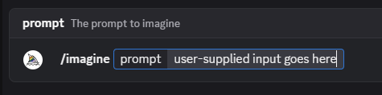

# MSC4391: Simplified in-room bot commands

> [!NOTE]
>
> This proposal is a simplification of
> [MSC4332: In-room bot commands](https://github.com/matrix-org/matrix-spec-proposals/pull/4332)
> that specifies only an object format for bot commands, to be embedded within
> message event content. The proposal does not make any impositions on the
> textual command syntax used by bots or clients. To make use of the MSC,
> clients and bots will have to implement a simple parser for the proposal's
> command invocation protocol, which is similar in nature to
> [JSON-RPC](https://www.jsonrpc.org/specification).

> [!NOTE]
>
> While this MSC expects and anticipates clients will start with text parsing of
> commands, for clients to provide their own syntax, and that TUI clients will
> likely always use text parsing. The MSC is designed specifically so that it is
> possible to support clients that will only provide a full command UI.

## Background

Interaction with matrix bots today is done by sending shell-like command within
the body of a Matrix `m.room.message` e.g.
`!draupnir unban @example:example.com --invite --no-confirm`.

This interface has the following problems:

- Users unfamiliar with command line interfaces have to learn heavily by example
  in order to start using bots, which may be providing essential functions
  within a matrix room or community.

- No feedback is provided within the clients if a user enters incorrect syntax,
  an unexpected argument, or a value of an incorrect type. Additionally, bots
  have to explain these failure modes to a range of users.

- The `body` emitted in `m.room.message` content is treated as _plain text
  fallback_ or markdown by most matrix clients, preferring to render
  `org.matrix.custom.html`. This means there are a number of inconsistencies in
  clients, particularly around the fallback for room and user pills, which can
  complicate and limit argument parsing
  https://github.com/the-draupnir-project/Draupnir/issues/131.

- Long help menus that can make it difficult to find the right command. Many
  clients already have a concept of "slash commands" which are
  [desirable to reuse](https://github.com/matrix-org/matrix-spec/issues/93) and
  [come up occasionally](https://github.com/matrix-org/matrix-spec/issues/2170) -
  finding a way to populate this feature with bot-specific details is
  beneficial.

- [_prompt_](https://github.com/the-draupnir-project/Draupnir?tab=readme-ov-file#prompt-ux)
  and [_button_](https://core.telegram.org/api/bots/buttons) interfaces have to
  be implemented with `m.reaction` events.

- _partial commands_ have to be implemented with `m.reaction`
  [prompts](https://github.com/the-draupnir-project/Draupnir?tab=readme-ov-file#prompt-ux)
  and replies containing an arbitrary payload of suggestions or a default. This
  also leads to noisy timeline views when there are multiple partial steps to
  entering a complete command (e.g. `!draupnir ban @spam:example.com`:
  [demo](https://github.com/the-draupnir-project/Draupnir/blob/main/docs/ban-command-prompt.gif)).

## Proposal

This proposal introduces the following in order to solve the above problems:

- _command description_ state events that can be used by a bot to communicate to
  clients the parameters of the command and the types of arguments that those
  parameters can accept.

- A JSON representation of a command and the user supplied arguments, which a
  client can send to the bot within a matrix event. This is a similar idea to a
  JSON-RPC request object.

- While a response format is not specified in this MSC, the MSC is designed to
  be forward compatible with a follow up MSC for _partial commands_ and
  _prompts_.

The proposal makes no attempt to specify the syntax of commands within an
`m.room.message` body or describe the syntax of those commands. This is
specifically to avoid the fallback version of the command becoming the source of
truth over the JSON representation, which was previously a source of
[compatibility issues](https://github.com/matrix-org/matrix-spec-proposals/pull/4332/files#r2313755345)
in [MSC4332](https://github.com/matrix-org/matrix-spec-proposals/pull/4332).
Advanced bots would be required some to make changes to their parsers.
Additionally the argument and overloading semantics in MSC4332 make _partial
commands_ and _prompts_ difficult to design. However, this proposal may be
extended by another proposal to specify a fallback derived from the JSON
representation that may work for many simple bots.

### Command description

A new state event type is introduced: `m.bot.command_description`. When
presenting command options to users, clients SHOULD use this event to suggest
commands, scoped by the `sender` of the description.

The `content` for such an event fits the following implied schema:

```jsonc
{
  "type": "m.bot.command_description",
  "sender": "@draupnir:draupnir.space",
  // derived from `sha256(command + mxid)`
  "state_key": "JBDLR6YMe+72yqsEMi/MVdTmjN3ynPThMz+M7QLATZQ=",
  "content": {
    // space separated string for commands such as "rooms add"
    "command": "ban",
    "parameters": [
      {
        "key": "target_room",
        "schema": { "schema_type": "primitive", "type": "room_id" },
        "description": {
          // Descriptions use m.text from MSC1767 Extensible Events to later support MSC3554-style translations.
          // See https://spec.matrix.org/v1.15/client-server-api/#mroomtopic_topiccontentblock
          // See https://github.com/matrix-org/matrix-spec-proposals/blob/main/proposals/1767-extensible-events.md
          // See https://github.com/matrix-org/matrix-spec-proposals/pull/3554
          "m.text": [{ "body": "The room ID" }],
        },
      },

      {
        "key": "timeout_seconds",
        "schema": { "schema_type": "primitive", "type": "integer" },
        "description": { "m.text": [{ "body": "The timeout in seconds" }] },
      },

      {
        "key": "apply_to_policy",
        "schema": { "schema_type": "primitive", "type": "boolean" },
        "description": {
          "m.text": [{ "body": "Whether to apply this to the policy" }],
        },
        // This argument is not required
        "optional": true,
      },

      {
        "key": "target_users",
        "schema": {
          "schema_type": "array",
          "items": { "schema_type": "primitive", "type": "user_id" },
        },
        "description": { "m.text": [{ "body": "The user ID(s)" }] },
      },
    ],
    "description": {
      // We also use m.text here for the same reason as the argument descriptions above.
      "m.text": [{ "body": "An example command with arguments" }],
    },
  },
}
```

A client may show the arguments and commands similar to Discord:



#### Invariants of command descriptions

- A command description with parameters that have duplicate keys is invalid and
  the command SHOULD be hidden by clients.

- The position of parameter descriptions in the _parameters_ property that are
  _required_ is significant and clients SHOULD use the same order when prompting
  for arguments.

- The position of parameter descriptions that are not _required_ is not
  significant.

- Command descriptions only specify commands for the sender of the
  `m.bot.command_description`. If the `sender` is not currently joined to the
  room, the command should be hidden.

- Parameters with an _array_ schema may appear in any place, not just at the end
  of the parameter list. This is to provide a ubiquitous way of providing
  multiple arguments. Clients that parse command text may need to provide
  special syntax for lists or multiple arguments in order to support _required_
  parameters that have an array schema.

- The state_key MUST be a padded base64 encoded SHA256 digest of the `command`
  property of the command description AND the mxid of the sender. This is in
  order to ensure that command descriptions are deduplicated and conflict free
  between different bots.

### Command invocation

When the user sends the command, the client creates either an `m.room.message`
or an `m.room.bot.command` event with the following `content` shape:

```jsonc
{
  // body is client supplied and may not match at all with the bot's fallback syntax.
  // body may be omitted entirely in an `m.room.bot.command`.
  "body": "@bot:example.org ban !room:example.org 42 true @alice:example.org @bob:example.org",
  "msgtype": "m.text",

  // Mentions should always be added, to lower the chances of command conflicts.
  // Bots SHOULD look for mentions where possible to avoid accidental activations.
  "m.mentions": {
    "user_ids": ["@bot:example.org"], // should be a single element array, containing the bot's user ID
    // from the `m.bot.commands` state event's `state_key` (or `sender`).
    // Note: doesn't include other users which may be referenced by the
    // command being sent, such as via `user_id` arguments.
  },

  // This is a new content block so bots don't *need* to do string unpacking when
  // commands are sent this way. Bots may still need to unpack `body` when users
  // send commands manually or without client support.
  "m.bot.command": {
    "command": "ban",
    "arguments": {
      // These are just the arguments and their user-supplied values.
      "target_room": {
        // Room IDs are special because they can carry routing information too.
        // Object types have a type specifier.
        "id": "!room:example.org",
        "via": ["second.example.org"], // Optional, but recommended.
        "type": "room_id",
      },
      "timeout_seconds": 42, // integers and booleans use appropriate value types (converted from (probably) strings)
      "apply_to_policy": true, // tip: clients can convert user input like "yes" to booleans
      "target_users": ["@alice:example.org", "@bob:example.org"],
    },
  },
}
```

Bots can then respond however they normally would to the command input.

Clients SHOULD be aware that some bots may attempt to create conflicts with the
client's built-in commands (such as `/myroomnick`) or the commands of other
bots. Where conflicts with built-in events exist, clients SHOULD NOT show the
bot's option to the user. Where conflicts with other bots exist, clients SHOULD
show the bot's name/user ID in the autocomplete text. For example, "@Giphy /gif
{search}". Clients MAY wish to always disambiguate commands like this to avoid
future conflicts with built-in commands. From an implementation perspective,
clients might cause their built-in commands to always take precedence over any
bot's commands to avoid users becoming confused.

### Type schema

> [!NOTE]
>
> The reason for providing an _integer_ type instead of a _number_ type to match
> the [JSON value](https://datatracker.ietf.org/doc/html/rfc8259#section-6) is
> because matrix.org's canonical JSON
> [does not support encoding floats](https://spec.matrix.org/v1.15/appendices/#canonical-json).

> [!NOTE]
>
> Bots SHOULD NOT rely on clients to validate or build input with respect to the
> input and should perform their own parsing of command arguments.

The following essential types are the predefined `types` for an argument:

- `string` - An arbitrary string.
- `integer` - An arbitrary whole number. May be negative or zero.
- `boolean` - `true` or `false` literal.

Constrained string types:

- `user_id` - Must be a valid
  [user ID](https://spec.matrix.org/v1.15/appendices/#user-identifiers) for the
  room version encoded as a string.
- `server_name` - Must be a valid
  [server name](https://spec.matrix.org/v1.15/appendices/#server-name).
- `room_alias` - Must be a valid
  [room alias](https://spec.matrix.org/v1.15/appendices/#room-aliases).

Room reference types:

- `room_id` - An object with the property `room_id` which must be a valid
  [room ID](https://spec.matrix.org/v1.15/appendices/#room-ids). The object
  SHOULD also contain a `via` property that contains an array of server names
  that the room can be joined via.
- `event_id` - An object with the same properties as `room_id` with the addition
  of an `event_id` property that must be a valid
  [event ID](https://spec.matrix.org/v1.15/appendices/#event-ids).

When an object is provided as the type schema, the type is a derived from a
schema described by the property `schema_type`:

- The `array` schema type specifies the type of the items with the `items`
  property. The following additional restrictions apply to `array`:
  - Arrays can only appear at the top level, `items` can only be a schema type
    of `union`, `primitive`, and `literal`.
- The `union` schema type specifies the types of the variants with the
  `variants` property. Which is an array of type schema. The following
  restrictions apply to unions:
  - Outside of the top-level, only an array of unions is permitted.
  - Nested unions are not permitted as they are unnecessary and should be
    flatted.
  - A union of arrays is not permitted.
  - Therefore `variants` can only be a schema type of `primitive` or `literal`.
- The `literal` schema type specifies a literal value with the `value` property
  and the type of the literal value with the `literal_type` property.
  - For simplicity only `boolean`, `integer`, and `string` may be provided for
    the `value` property. This may be extended in future if need is found.

> [!TIP]
>
> Clients can accept a wider variety of inputs for some types, provided they
> reduce them down to the expected value types when sending the command. For
> example, accepting a room permalink for a `room_id` type, or "yes" in place of
> `true` for a `boolean`.

## Extensions

The following extensions/features are best considered by future MSCs:

- A standardised command response similar to JSON-RPC response object. This
  would also enable dynamic and arbitrary prompt flow.

- Specifying a minimum power level required to send a command, to hint to users
  that a command may be unavailable to them. This wouldn't be enforced by auth
  rules, but clients can stop a lot of the accidental usage if they know the
  power level the caller must have.

- Specifying a non-`m.room.message` event template to send instead. This could
  be useful if the bot wants to minimize "visible" traffic in the room or has
  custom event types it wants to use. In future, being able to specify
  extensible event content blocks which should be added to the resulting event
  may be a better option. In either case, bots should not be able to cause users
  to send state events to prevent bots from tricking users into changing power
  levels, join rules, etc.

- Support for non-text-like arguments like images, files, etc.

- Some predefined validation on arguments, like a range for integers or
  maximum/minimum length of strings.

## Potential issues

- Using state events limits a bot's ability to advertise commands if it isn't
  given power to do so.

## Alternatives

- Not using state events would work, but can be tricky to manage. This proposal
  fills a gap until proposals which solve the problem space more completely are
  written and proven by implementation. Sticky events maybe?

- [MSC4332](https://github.com/matrix-org/matrix-spec-proposals/pull/4332). As
  stated throughout this proposal, MSC4332 makes a number of complicated
  considerations for command syntax that are not backwards compatible for all
  bots. In addition the semantics for variadic and positional arguments as they
  appear in the MSC make it difficult to implement _options_, _prompts_ and
  _partial commands_
  https://github.com/matrix-org/matrix-spec-proposals/pull/4332#discussion_r2313755345.
  This MSC uses a JSON object to supply arguments to a command and provides
  union and array types that can be used to implement variadic arguments and
  various styles of options.

## Security considerations

Mentioned in the proposal, clients should be explicitly aware that bots may try
to create confusion for users and override built-in commands or another bot's
commands. For example, a bot may advertise a `myroomnick` command which leads to
the client's functionality not working as expected. Clients should be taking
measures to minimize this confusion from happening, and always showing the
profile of the sender that registered the command.

## Unstable prefix

While this proposal is not considered stable, implementations should use
`org.matrix.msc4391.command_description` in place of `m.bot.command_description`
and `org.matrix.msc4391.command` in place of `m.bot.command`.

## Dependencies

This proposal has no direct dependencies, but benefits more strongly from the
following Extensible Events MSCs:

- [MSC1767 (accepted)](https://github.com/matrix-org/matrix-spec-proposals/blob/main/proposals/1767-extensible-events.md)
- [MSC3554: Translatable Text](https://github.com/matrix-org/matrix-spec-proposals/pull/3554)
