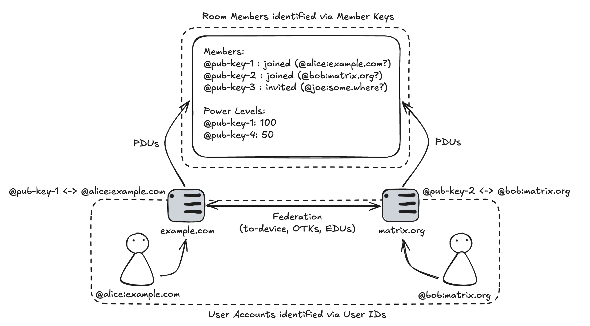

## MSC4430: Member Keys

The purpose of this MSC is to change the representation of user IDs in Matrix for the following reasons:
 - We want to make events self-verifying in order to ensure no server incorrectly [drops](https://spec.matrix.org/v1.14/server-server-api/#checks-performed-on-receipt-of-a-pdu)
   events depending on the server signing key they happen to have for that server at any particular time.
 - We want to _be able to_ remove the [localpart](https://spec.matrix.org/v1.17/appendices/#user-identifiers)
   of user IDs from the append-only room DAG for the purposes of GDPR erasure and moderation (abusive localparts).
 - We want to improve our metadata posture by making it harder to correlate users between room DAGs.
 - We want to support future changes which would allow the domain of a user to change (account portability).

The primary way we do this is by making user IDs public keys.

This follows the wider pattern of IDs becoming cryptographic primitives:
 - Event IDs were converted to SHA-256 hashes of the event JSON in [MSC1659](https://github.com/matrix-org/matrix-spec-proposals/pull/1659)
 - Room IDs were converted to SHA-256 hashes of the create event in [MSC4291](https://github.com/matrix-org/matrix-spec-proposals/blob/matthew/msc4291/proposals/4291-room-ids-as-hashes.md)

There exists a long list of MSCs which attempt to change the structure of the user ID
and a comparison of this proposal to others can be seen in the Appendix.
For a more comprehensive look at the background and context of these changes, along with tradeoffs
this proposal is making, see the Appendix.

Terminology:
 - _User ID_: Identifiers of the form `@localpart:domain`.
 - _User_ or _User Account_: An account on a homeserver, today uniquely identified via _User IDs_.
 - _Room member_: A _user account_ participating in a room.
 - _Member Key_: Identifiers of the form `@public-key`.

### Proposal




Room members are no longer represented as User IDs. Instead, they are represented as Member Keys:
 - Each room member is identified using an Ed25519 key: a "Member Key".
 - The Member Key is scoped per-user, per-room. This means each user account will have many Member Keys.
 - The Member Key SHOULD NOT change if the user leaves and re-joins the room.
 - The `sender` of events is represented as the unpadded urlsafe[^urlsafe] base64 encoded public part of the Member Key.
   An example `sender` is: `@l8Hft5qXKn1vfHrg3p4-W8gELQVo8N13JkluMfmn2sQ`.
 - Events are signed by the Member Key.

Member Keys can present _linkage information_ in the `m.room.member` event:
 - The `content` of the `m.room.member` event is modified to include new fields:
    * `localpart`: The claimed localpart for this Member Key. Redactable for GDPR / moderation.
    * `domain`: The claimed domain for this Member Key. Not redactable as it provides routing information.
 - The `m.room.member` event is _additionally signed_ by the server signing key for the `content.domain` specified.

This link can be _verified_ by:
 - [Asking](https://spec.matrix.org/v1.17/server-server-api/#retrieving-server-keys) `content.domain` for their _current_ server signing key.
 - [Checking](https://spec.matrix.org/v1.14/appendices/#checking-for-a-signature) the `m.room.member` event has a valid signature from that server signing key.

Links MUST be periodically rechecked to allow for server signing keys to be rotated, or domains to be reused.
This means a previously verified link can revert to unverified.

Events received by Member Keys with _unverified links_ are automatically soft-failed.
This means message events are not sent to clients, but state events still participate in state resolution and events can appear in the room state.
   
Signatures on an event follow the same format as today for backwards compatibility with existing server code, but:
 - the [entity](https://spec.matrix.org/v1.14/appendices/#checking-for-a-signature) signing the event is now the constant `sender`.
 - the [signing key identifier](https://spec.matrix.org/v1.14/appendices/#checking-for-a-signature) is now the constant `ed25519:1`.

An example event with the new identifiers:
```json
{
  "type": "m.room.name",
  "state_key": "",
  "content": {
    "name": "My Room Name"
  },
  "room_id": "!K3DOWWLmkHLl52yJ-vT8J5jX5wuYZati_KvC6PliIPE",
  "sender": "@l8Hft5qXKn1vfHrg3p4-W8gELQVo8N13JkluMfmn2sQ",
  "signatures": {
    "sender": {
      "ed25519:1": "these86bytesofbase64signaturecoveressentialfieldsincludinghashessocancheckredactedpdus"
    }
  }
}
```

The `m.room.member` event with co-signatures from the server signing key:

```json
{
  "type": "m.room.member",
  "state_key": "@l8Hft5qXKn1vfHrg3p4-W8gELQVo8N13JkluMfmn2sQ",
  "content": {
    "membership": "join",
    "localpart": "alice", // <-- NEW
    "domain": "matrix.org" // <-- NEW
  },
  "room_id": "!K3DOWWLmkHLl52yJ-vT8J5jX5wuYZati_KvC6PliIPE",
  "sender": "@l8Hft5qXKn1vfHrg3p4-W8gELQVo8N13JkluMfmn2sQ",
  "signatures": {
    // NEW: co-signed by the member key and matrix.org server
    "sender": {
      "ed25519:1": "these86bytesofbase64signaturecoveressentialfieldsincludinghashessocancheckredactedpdus"
    },
    "matrix.org": {
      "ed25519:123def": "these86bytesofbase64signaturecoveressentialfieldsincludinghashessocancheckredactedpdus"
    }
  }
}
```

#### Server behaviour

When a server receives new `m.room.member` events, it will receive
a Member Key along with linkage information.
No external requests need to be made in order to verify the sender signature in the event as they are signed with the Member Key.
This ensures that **all servers will agree** whether or not the event passes [Step 2](https://spec.matrix.org/v1.17/server-server-api/#checks-performed-on-receipt-of-a-pdu) of the PDU checks.
External requests MAY be required to verify the linkage information if the server does not already have
am unexpired, cached copy of the server signing key for the claimed domain.
This means not all servers will agree if the linkage information is verified or unverified.
However, this does not affect the room authentication/authorisation model at all as that is solely using Member Keys.

Rooms with the `restricted` join rule are impacted because we no longer want to check that the server domain signed the event.
The `join_authorised_via_users_server` field is currently a _user ID_, so this is modified to be a Member Key, and servers verify that there is a signature with that key. For clarity, auth rules are modified like so:

> If type is `m.room.member`:
> - [...]
> - If `content` has a `join_authorised_via_users_server` key: 
>    * If the event is not validly signed by the ~~homeserver of the user ID denoted by the key~~ member key, reject.

The following `m.federate` auth rule is no longer enforceable because the `sender` field no longer has a domain:

> If the content of the `m.room.create` event in the room state has the property `m.federate` set to `false`, and the `sender` domain of the event does not match the `sender` domain of the create event, reject.

Instead, `m.federate` will now function the same as server ACLs. When `m.federate` is `false` then the server MUST reject _all_ inbound federation traffic for that room).
This is preferable to the alternative of only accepting member events signed with the creator's server signing key because it allows the server signing key to be rotated/lost.
TODO: how does this work when a local user invites a federated user? We presumably send that over federation but they can never accept it?

#### Server signing key loss & compromise

Servers MUST periodically [re-check](https://spec.matrix.org/v1.17/server-server-api/#retrieving-server-keys) the server signing key is still active and current. 
"Active and current" means:
 - The server signing key is listed under [`verify_keys`](https://spec.matrix.org/v1.17/server-server-api/#get_matrixkeyv2server). Both the key ID and `key` MUST match what was previously retrieved. 
 - The [`valid_until_ts`](https://spec.matrix.org/v1.17/server-server-api/#get_matrixkeyv2server) value is in the future. If the server is unable to retrieve server keys when this expires, the key _remains valid_. "Unable to retrieve" means that the endpoint did not respond with a valid HTTP response, or responded with a valid HTTP response that is not 200 OK or 404 Not Found. This has the effect that we do not expire keys on connectivity issues; only if there is an _explicit_ acknowledgement that the key is no longer active.


Servers already periodically recheck based on the [`valid_until_ts`](https://spec.matrix.org/v1.17/server-server-api/#get_matrixkeyv2server) field of the server key response, so this MSC makes no attempt to modify the polling frequency.
If the server signing key is no longer current (it is present in `old_verify_keys` or has a `valid_until_ts` in the past or is absent entirely) 
then all verified links are set to unverified. This is expected to happen for the following scenarios:
 - The server signing key was compromised and was rotated.
 - The server signing key was lost and a new one was created.
 - The homeserver running at that domain was deleted and a new one was created.
   This new homeserver may be run by someone else in the case of domain reuse.

Upon rotating the signing key, the server SHOULD
re-sign all `m.room.member` events with the new server signing key.
This ensures only authorised member events have verified links.
This can be done without changing the hashable fields on the event, meaning the event ID does not change.

One strategy for implementing this behaviour is to:
 - Index all `m.room.member` events by the server signing key used to sign the event.
 - When the server signing key is invalidated, start a background job to process `m.room.member` events.
 - For each event, query the event ID again by _directly asking_[^direct] the `content.domain`.
 - If the server returns the same event signed with the new server signing key, update your copy of the event JSON and continue: the Member Key remains verified.
 - If the server doesn't know the event, doesn't respond, or it isn't correctly signed, mark that Member Key as unverified.

The [signing key validity period](https://spec.matrix.org/v1.15/rooms/v5/#signing-key-validity-period) introduced in room version 5 does not apply to `m.room.member` events
(the only event type the server signing key signs in this proposal) signed in rooms `vNext`.
Only the _current server signing key_ is valid.
This ensures an attacker who has compromised both the server signing key and member key
(which would be typical as they are co-located) cannot send a new `m.room.member` event with an `origin_server_ts` that falls within the validity period of a key in `old_verify_keys`,
and thus produce an `m.room.member` event which would be accepted by other servers.
This is ultimately why `m.room.member` events must be re-signed.

It may not be possible to re-sign events in the event that the database was lost.
If the server signing key was kept and was being published over federation, then linkage information would remain verified.
If the server signing key was also lost along with the database, then linkage information would revert to unverified _only if_ there is another homeserver responding to the [endpoint](https://spec.matrix.org/v1.17/server-server-api/#get_matrixkeyv2server) OR the endpoint returns 404 Not Found.

#### Member key loss & compromise

There is no mechanism to revoke or rotate a lost or compromised Member Key.
This mechanism will be added in a future MSC, see the Appendix for more information.

The primary safeguard in place is to _rotate the server signing key_ on Member Key loss or compromise.
This ensures that those room members eventually end up with unverified links, and thus messages sent with the compromised key are
soft-failed.

#### GDPR Erasure

When a User wants to be erased, the server MUST redact all `m.room.member` events that belong to that User, including historical `m.room.member` events.
The redaction event serves as the [notification mechanism](https://gdpr-info.eu/art-19-gdpr/) for erasing that room member from other servers.
This process is imperfect. The server will be unable to redact `m.room.member` events for rooms it is no longer joined to.
This will be improved in a future MSC.

This erasure MUST be communicated to clients via the mechanism proposed in [MSC4428](https://github.com/matrix-org/matrix-spec-proposals/pull/4428).

#### Querying member keys for a user account

There is a chicken/egg problem for some federation operations e.g invites,
as clients will invite a User ID into a room, and will not know the Member Key yet.
The sending server will also not know the Member Key, and so a new federation endpoint has to be added to
query a Member Key for a particular User ID.
This endpoint will be used for the following scenarios:
 - A user wants to invite someone not on the same server.
 - A user wants to pre-emptively ban someone not on the same server.
 - A user wants to pre-emptively promote someone not on the same server.

The endpoint looks as follows:
```
GET /_matrix/federation/v1/member_key/{roomId}/{userId}

HTTP/1.1 200 OK
{
    "member_key": "@l8Hft5qXKn1vfHrg3p4-W8gELQVo8N13JkluMfmn2sQ"
}
```

Upon receiving a member key request, if the user ID is known to the server, a member key for that user in that room should be created/returned.

The rationale for this is that:
 - The response can be easily cached as the member key does not change for a given user ID and room ID.
 - It's _intentionally_ NOT a bulk endpoint to discourage account crawling, as by returning a `member_key`
   it indicates that the `userId` is registered. Since the scenarios do not require bulk lookups, no
   bulk lookup exists.

#### Federation API changes

The following endpoints which currently accept a `{userId}` are changed to accept a `{memberKey}` instead:
 - [`GET /_matrix/federation/v1/make_join/{roomId}/{userId}`](https://spec.matrix.org/v1.17/server-server-api/#get_matrixfederationv1make_joinroomiduserid)
 - [`GET /_matrix/federation/v1/make_knock/{roomId}/{userId}`](https://spec.matrix.org/v1.17/server-server-api/#get_matrixfederationv1make_knockroomiduserid)
 - [`GET /_matrix/federation/v1/make_leave/{roomId}/{userId}`](https://spec.matrix.org/v1.17/server-server-api/#get_matrixfederationv1make_leaveroomiduserid)
 - The `state_key` field in the request body for [`PUT /_matrix/federation/v1/invite/{roomId}/{eventId}`](https://spec.matrix.org/v1.17/server-server-api/#put_matrixfederationv1inviteroomideventid) is now expected to be a Member Key not a User ID.

For clarity, [`GET /_matrix/federation/v1/user/devices/{userId}`](https://spec.matrix.org/v1.15/server-server-api/#get_matrixfederationv1userdevicesuserid).
is not affected by this change as the user ID is not room scoped. This means if a server is unable to map a member key to a user ID, it will be unable
to fetch device lists for that room member and E2EE will break. This is reasonable because servers are in general only unable to perform the mapping if
the remote server is unavailable, in which case E2EE will break anyway.

The `allow` and `deny` fields of the `m.room.server_acl` event only apply to verified links. This prevents attackers from claiming a trusted domain in `content.domain` to bypass server ACLs.

#### Client-Server API changes

Clients MUST support [MSC4428: Stable identifiers for Room Members](https://github.com/matrix-org/matrix-spec-proposals/pull/4428) in order to be notified about the user ID of room members correctly.
The stable ID value is the Member Key.
Unverified links set the `user_id` to `null` in the member_info map.
Verified links set the `user_id` to the verified user ID in the `member_info` map.


### Potential Issues

This proposal unintentionally introduces account portability because the domain in the linkage information is mutable.
It is possible for a new server to take all the Member Keys from another server and then send updated `m.room.member` events
pointing to the new domain. This is incredibly risky because nothing stops the old server from keeping the Member Keys to
subsequently take back control, and so it is not a secure way to port accounts.
This can also break clients because 
[Signatures on One-Time Keys](https://spec.matrix.org/v1.17/client-server-api/#key-algorithms) will be made invalid,
as will [Cross-Signing Keys](https://spec.matrix.org/v1.17/client-server-api/#cross-signing) as they involve signing the
now mutable user ID.
The alternatives to stop unintentional account portability are:
 - keep the domain in the user ID e.g. `@member-key:domain`. Whilst servers could exchange member keys, this would then be presented as a different user.
 - add rules to prevent the `content.domain` from changing aka Trust On First Domain. The problem with this is that
   there is no good definition of "first" that isn't controllable by an attacker e.g. they fork the DAG at the time the member key first joined
   and purposefully set lower timestamps / lower event ID hash / etc to ensure it is treated first. If you do this
   out-of-DAG (e.g. the first INSERT into a database) then new users who join a room may disagree on what the first domain is,
   as it is decided by the first event they happened to see in the `/send_join` response,
   resulting in 1 member key having _different_ verifiably linked user IDs depending on the server.


### Security considerations

Compromised Member keys can still be used to update room state, as state events are not affected by soft failure.
This has an impact on the security of the room in the following ways:
 - Unauthorised invites: any compromised Member Key can invite an attacker-controlled User to an invite-only room, breaching confidentiality of the room regardless of whether the room is encrypted or not. End-users must monitor the member list for suspicious invites/members.
 - Denial of Service: a compromised moderator or administrator can kick/ban everyone in the room.

Phishing / Spoofing, where an attacker can _send_ messages pretending to be the compromised member, is mostly mitigated in this design
because:
 - End-to-end encrypted rooms are protected if other room members have verified the compromised member as the attacker does not have access to client-held cryptographic secrets. NB: the attacker will have encryption keys via unauthorised invites so could _read_ messages, just not _send_.
 - Messages are only valid until the server signing key is rotated, meaning there is a finite window
   in which an attacker can pretend to send _messages_ as someone in unencrypted rooms.

When combined with unintentional account portability (see "Potential Issues"), an attacker may have
greater success at both phishing and unauthorised invites by swapping a similar looking domain into the room
e.g. `@alice:martix.org`.

A malicious server can cause large amounts of CSAPI traffic by constantly invalidating / validating their server signing key
(e.g. moving it to and from `old_verify_keys`), as this causes the `member_info` map to be updated.
This is mitigated by recommending that servers directly[^direct] ask the malicious server for their member events again, adding a huge bandwidth cost to change your server signing key.

Servers may lie about their domain e.g. an attacker may join a very busy room with a throwaway server signing key and claim `content: { domain: "victim.com" }` in their `m.room.member` event.
This means `victim.com` will be pushed events as a form of amplification attack.
Servers MUST have a global backoff timer per-domain to ensure that attackers cannot repeatedly join users with fake domains to popular rooms to cause amplification attacks.

Servers may intentionally lie about their server signing key to some servers but not others.
This will cause room members on the lying server to appear as verified to some servers and unverified to others.
Servers are free to [implement custom mechanisms](https://github.com/element-hq/synapse/pull/18238) to
enable specific clients to see these soft-failed events in order to process spam effectively.

As a consequence of assuming server signing keys remain valid if the server is unreachable, there is an edge case where a compromised server signing key may still be used.
This happens when the domain is no longer running a homeserver and there is no reverse proxy in place to return 404 Not Found to the [` /_matrix/key/v2/server`](https://spec.matrix.org/v1.17/server-server-api/#get_matrixkeyv2server) endpoint.
In this scenario, the server signing key never expires.
The alternative option to eventually expire server signing keys for unreachable servers introduces an upper bound to how long servers can remain partitioned on the network, which is undesirable because there is currently no upper bound in place in Matrix, and a key design goal is to maximise availability.

### Unstable prefix

- The room version is `org.matrix.12.xxxx` based on room version 12.
- The endpoint `/_matrix/federation/v1/member_key/{roomId}/{userId}` is `/_matrix/federation/unstable/org.matrix.mscXXXX/member_key/{roomId}/{userId}`

### Dependencies

None.

### Appendix

#### Comparison with other proposals

MSC | User ID Format | Name of key? | Who owns this new key? | Key scope | Localpart location | Domain location | How to verifiably map user ID to domain? | How are user IDs communicated to clients? | Can the key be revoked?
----|----------------|------------------|---------------------------|-------------------|--------------------|-----------------|------------------------------------------|-------------------------------------|-----------------
Now | `@localpart:domain` | Server signing key | Server | Per-Server | User ID | User ID | Use server-signing key, drop event if incorrectly signed | Only verified user IDs because we drop unverified | Yes, via [`old_verify_keys`](https://spec.matrix.org/v1.17/server-server-api/#get_matrixkeyv2server)
1228 | `^user-room-key` | User-Room Key | Server | Per-User, Per-Room | `m.room.member` content | `m.room.member` content | Use server-signing key | `verified_sender_mxid` | No, start over
2787 | `^0x01user-delegated-key` | User Delegated Key | Server (attested by Client) | Per-User, Per-Room | Undefined | `m.room.member` content | Undefined | User Delegated Keys | Yes, attestation has an `expires`
4014 | `sender_key` | Sender Key | Server | Per-User, Per-Room | `m.room.member` content | `m.room.member` content | Use server-signing key | Verified user IDs, unverified use `_unverified_` localpart namespace | No, start over
4243 | `@account-key:example.com` | Account Key | Server | Per-User | Server | User ID | Ask direct via `/query/accounts` | Only verified user IDs | No, start over
4345 | `@localpart:server-key` | Per-Room Server Key | Server | Per-Server | User ID | `m.server.participation` content | Use server-signing key | `unsigned.server_domain` | Yes, by room admin or key owner per-room
4348 | `@account-key` | Account Key | Client? | Per-User (attested by Server) | Server | `m.server.participation` via Server signature | Use server-signing key | `unsigned.account` | No, start over
This MSC | `@member-key` | Member Key | Server | Per-User, Per-Room | `m.room.member` content | `m.room.member` content | Use server-signing key | [MSC4428](https://github.com/matrix-org/matrix-spec-proposals/pull/4428) | No, but keys can be soft-failed via [`old_verify_keys`](https://spec.matrix.org/v1.17/server-server-api/#get_matrixkeyv2server)

#### Tradeoffs

The more the user ID format changes, the harder it is to land as an incremental change. This is why some MSCs choose to keep the format looking "roughly" correct. As the ecosystem experienced in [MSC4291](https://github.com/matrix-org/matrix-spec-proposals/pull/4291), changing the structure of an identifier can cause weird things to break. Some clients may blindly apply a regular expression over the user ID to check for compliance, even if they don't actually need access to the localpart or domain. [Auth rules](https://spec.matrix.org/v1.17/rooms/v12/#authorization-rules) would need to be updated if the sigil changed (see Step 9), and so on.

Changes which force the client to become aware of new cryptographic keys are very disruptive for similar reasons. At one extreme, it can lead to clients being abandoned as the developers do not have time to add complex event signing logic or implement the state resolution algorithm that would otherwise support desirable features like client-controlled cryptographic room membership and client-controlled account portability. This is why most of the proposals keep the server as the ultimate owner of the key.

The scope of the key has a wide range of tradeoffs too:
 - Per-Server keys like we have today correctly model the resting place of key material: a server somewhere. If the key is compromised, a single revocation can (in theory) invalidate all affected events. However, this is incompatible with account portability as you cannot share the key with a user who wishes to migrate accounts to a new server. Additions like namespaced account IDs prevent attackers from correlating the same user across rooms by randomising the account ID per room, but this doesn't help single user homeservers.
 - Per-User keys are more tightly scoped and are compatible with account portability. Whilst these keys nearly always reside on the server for now, in the future they could be given to the client. There are moderation concerns here because we don't know which server these events originate from. Some proposals have the server signing key co-sign events to protect against this. As keys are user scoped, you can correlate the same user across multiple rooms.
 - Per-Room, Per-User keys are even more tightly scoped and are also compatible with account portability (except now you're exchanging a key bundle rather than a single key). This provides the best metadata protection as you can't correlate the same user across multiple rooms. However, this is also a curse as you cannot provide [useful functionality](https://github.com/matrix-org/matrix-spec-proposals/pull/2666) so in practice all proposals which use this additionally use server signing keys to provide linkage information, though these links can be forgotten.

The `localpart` location is important for GDPR erasure and to be able to redact abusive or spammy localparts for moderation purposes. Currently, it can't be removed because it forms part of the user ID.  Most proposals move this to the `m.room.member` event, putting it logically in the same bucket as `avatar_url` and `displayname`. This makes erasure deceptively simple: redact the `m.room.member` event. There are problems with this though. Firstly, you need the concept of a super redaction as moderators may simply want to remove an abusive display name rather than remove that member's identity (localpart) in the room. Secondly, you may no longer be in the room and so cannot redact your (particularly _historical_) `m.room.member` events. Some proposals address this by moving the localpart behind a network request to the server domain. This has its own set of problems though: how do you provide a [notification mechanism](https://gdpr-info.eu/art-19-gdpr/) since you can no longer rely on redactions? This also _forces_ a network request for each unique key, which impacts reliability and performance.

The majority of proposals move the domain to the `m.room.member` event. This introduces unintentional account portability because the `domain` key is mutable. Keeping the domain part of the user ID ensures that the permissions granted to a user remain pinned on the intended domain.

The majority of proposals still have the concept of a server signing key, and use it to group together per-user or per-room per-user keys. This allows them to assert that the data in the `m.room.member` event is correct (if outdated) without performing network requests to the domain for each key. They can do this by relying on the fact that the server signing key signed the `m.room.member` event as proof that the key resides on that server, amortising lookups to be one per server signing key, as we do today.

There is a wide range of ways that verified / unverified users are communicated to clients. These fall into three categories:
 - Pretend unverified users don't exist. Opt to only communicate verified users, accepting that room state will diverge _for clients_ but not _for servers_. This ensures that clients don't need to be changed, but doesn't entirely fix room state split brains.
 - Map unverified users to their own domain or own localpart to let them still be compatible with clients. Alternatively, add data to `unsigned` to indicate that they are unverified/verified. This provides some optionality and low levels of risk. Clients _may_ handle the new fields if they are aware of them, and clients _may_ break in weird ways, but should _generally_ function correctly.
 - Pretend the old-style of user ID does not exist. Opt to only send keys down to clients. This is the most invasive approach because any client which does not know how to handle this will be unable to participate in those new rooms. Breaks every client unless they know how to handle the new ID format. This is effectively the approach taken in [MSC4428](https://github.com/matrix-org/matrix-spec-proposals/pull/4428).

#### Future work

##### Post Quantum

EdDSA is not quantum safe.
Unfortunately, quantum safe alternatives like [ML-DSA-65](https://nvlpubs.nist.gov/nistpubs/fips/nist.fips.204.pdf) have large public key sizes (1952 bytes compared to Ed25519's 32 bytes).
This makes them impractical for use inside user IDs which are limited to 256 bytes.
To support this, the Member Key would need to be inside the `content` of the `m.room.member` event,
and the hash of the Member Key would be used instead e.g. `@SHA256(member-key)`.
This means a server MUST have seen the `m.room.member` event _before_ any other event sent by that user in order to be able to verify the signature of subsequent events. This is already the case in Matrix today, with the exception of the `m.room.create` event which is created prior to the first `m.room.member` event.
Note this does not apply to the server signing key, as that is not embedded into any event.

##### P2P

This assumes an overlay network where peers are addressable by public key. 
This was the approach taken by Dendrite when they experimented with [Pinecone](https://matrix.org/blog/2020/06/02/introducing-p2p-matrix/).
There are no per-user public keys used in this proposal (it's all per-user per-room), meaning the peer address would likely have to be the 'server signing key'.
Since the address/domain _is_ the server signing key, events would never be soft-failed as there is no network lookup required to verify linkage information. This comes at a price of having long opaque identifiers though, a case of [Zooko's triangle](https://en.wikipedia.org/wiki/Zooko's_triangle).

##### Account Portability

Portable accounts refers to the idea of moving a user from one server to another. There are broadly two types:
 - Client-controlled accounts: The end-user is free to migrate to any server without permission from the server they are currently on. For example, matrix.org would want to operate client-controlled accounts.
 - Server-controlled accounts: The end-user needs to request permission to migrate away from their server. For example, companies and organisations running homeservers for their employees would want this to prevent information leaking and for legal & compliance reasons. Migration may be forbidden for these accounts.

This section primarily focuses on client-controlled account portability.

This MSC already supports a very insecure form of account portability.
There would need to be significant ecosystem investment to land portable accounts because clients would need to become aware of the underlying Member Keys, and to treat User IDs as mutable. [MSC4428](https://github.com/matrix-org/matrix-spec-proposals/pull/4428) goes a long way towards this.

In order to securely migrate from one server to another, it must be possible to revoke keys from the old server.
This proposal does not enable this because the key _identifying_ the room member is the same as the key _signing_ events: the Member Key.
Instead, private Member Keys would only reside on the client, and would serve as the identity of that room member in that room.
A Member Key would _delegate_ signing responsibility to the _server signing key_ of the server they are currently on.
This forms an attestation, which can be ordered (e.g. by also signing a generation number).
The attestation would be inserted as a state event into the room, perhaps as part of the `m.room.member` event (though membership and attestation are orthogonal concepts).
State resolution and auth rules would be modified to ensure higher generation numbers replace lower ones.
This would allow the Member Key to sign a higher attestation to move signing responsibility to a new server signing key, without exposing the private Member Key to any server.
Note that this no longer makes events self-verifying as the server signing key is signing the event, not the Member Key. This technique preserves deniability as the server is free to sign any event it likes with the attestation it has.
Events would only be self-verifying in the context of the room state at that point in the DAG, much like how membership is handled (we'd need this anyway for PQ keys).
Alternatively, we could bundle the server signing key with every event, but this has its own problems (PQ sizes, what if it doesn't match the room state at that point in the DAG?, etc).

##### Client-controlled Cryptographic Room Membership

Today, servers can masquerade as their users to send membership events.
It would be more secure if servers could not do this, and had to get permission from someone already inside the room.
This is what client-controlled cryptographic room membership is.
The client would need to sign off on all membership events with a key the server does not control.
This is very similar to the Account Portability section except the _client_ is the one signing events, not the server.
This would require a new Client-Server API endpoint to enable clients to send fully signed federation events.
This would also likely rely on _clients_ calculating the room state (and so implementing state resolution) else the server could manipulate where in the room DAG client-signed membership events reside.
Care must be taken if the protocol wishes to preserve deniable authentication currently in place for off-the-record messaging.
Forcing a participant to cryptographically sign every event with a key only they control would compromise this.
This could be mitigated by only cryptographically signing membership changes, meaning only membership changes would be undeniable.


[^urlsafe]: We want the member key to be url-safe because it frequently appears in URL paths in the client-server API e.g account data,
profile data, user reporting and the Federation API e.g `/make_knock|join|leave/{roomID}/{userID}` and `/users/devices/{userID}`. This aligns
with other base64 data like event IDs and room IDs which are also urlsafe but notably is in conflict with _signatures_ which are not urlsafe.
[^unverifstate]: Since unverified links can participate in state resolution, events from these senders
may appear in room state, so they must be transformed into a user ID which is compliant. The TLD `invalid`
is [reserved](https://www.rfc-editor.org/rfc/rfc2606.html#section-2) so it cannot become a valid TLD in the future.  
[^stateafter]: In the current sync API, in absence of `use_state_after`,
it is not actually tracking the current state, thus it isn't safe to just inject the events randomly.
[^direct]: As a result, changing your server signing key means a lot of servers are going to ask **you** for your events again. This is intentional, as it discorages spam attacks where malicious servers constantly change their server signing key.
