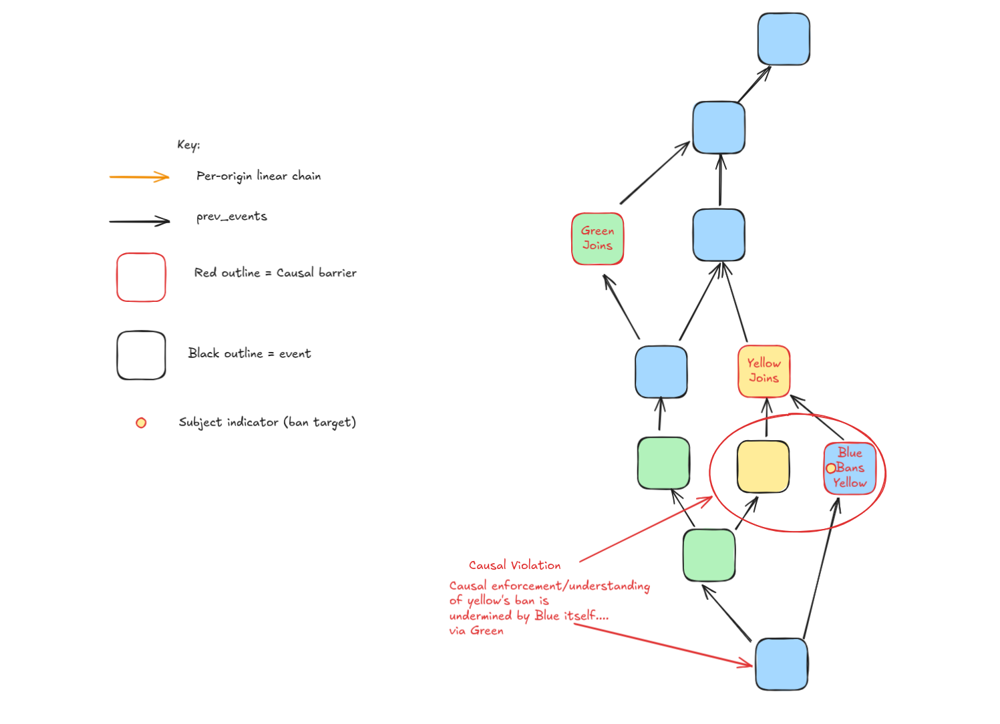
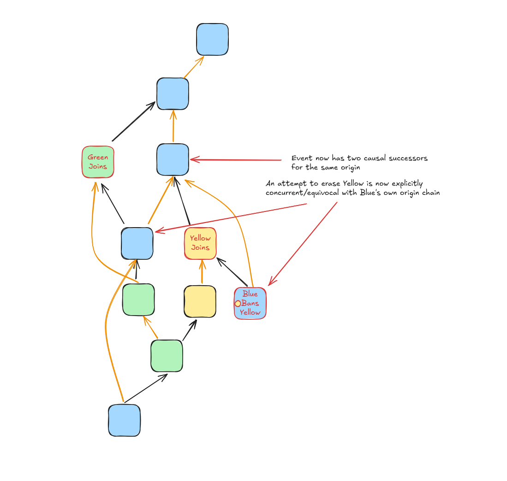

# MSC0000: Per origin linear chain

Currently, servers can produce events that are disconnected from the
server's own causal history. This allows servers to produce events
that are deteched or at conflict with their own decisions. This issue
is exacerbated as servers can also create events concurrent with their
own, and it is not actually possible to prove a given server is a
byzantine traitor/equivocator.

These conditions allow for servers to ignore their own causal history
in order to erase or modify it, leaving other servers without proof of
malice or inconsistency.

## Example using today's room model

Consider A scenario where there are three servers in a room: Blue,
Green, and Yellow. Consider that Blue immediately bans Yellow after
Yellow joins the room and the ban event directly references Yellow's
join in `prev_events`. Consider that concurrent to Blue's ban,
Yellow sends a message. So that Yellow's join event has to known
causal successors, Blue's ban targetting Yellow, and Yellow's
message.

Now consider that Green sends an event referencing Yellow's message
in `prev_events`, and forwards this to Blue.

Now consider that Blue sends an event that references Green's event,
indirectly tying up the diverging branch, but inadvertanly introducing
Yellow's concurrent message into Blue's own recognised causal history.

### Discussion

This is a huge problem. Blue has inadvertently been tricked into referencing
an event that it has likely soft failed (under partial sync). This example
demonstrates that `prev_events` cannot be used as a causal frontier
for a given server's understanding of causal history, because
the server is not actually in control of its own history.

Additionally, it is impossible to know whether Blue's ban on Yellow is
an attempt to abuse the room model to erase Yellow's message
retroactively.

## Proposal

We propose that a new field is added to the PDU, the
`origin_predecessor`.

This means that every event will reference either one or no
predecessors from the same origin.

This has some major advantages:

- Intentional forks are explicit and detectable. Servers cannot create
  events concurrent to their own causal predecessors without
  explicitly ignoring their maintained forward extremity. The proposal
  does not prevent this, but it does mean that such an equivocation is
  detectable and provable. And so the sender's repuatation can become
  tarnished as they are now known to be a byzantine traitor.

- Within the context of the terminology from [MSC4349: Causal barriers
  and
  enforcement](https://github.com/matrix-org/matrix-spec-proposals/pull/4349),
  when servers abuse causal barriers (e.g. membership events) to erase
  either their own, or another server's history, this is now always
  detectable.

In addition this enhances serveral other proposals both current and
future:

- In-DAG key based MSCs such as MSC4243 and MSC4345, and any
  psuedo-identity proposal: it is simplier to reason about key
  revocation or rotation when describing the causal frontier for which
  the key was valid.

- Any attempt to specify an epoch based synchronisation for rooms
  would both be simplified through the use of linear chains and also
  and also more secure through equivocation detection.

- Ban events would no longer be plagued by soft failure, as a future
  proposal could mandate that the ban is scoped to a target's
  predecessor. In order to canonicalise the events that the target
  sent before they were banned.

### An example of bans with linear origin chain

Now with a linear origin chain in place, we can determine that Blue's
ban on Yellow was not an attempt to erase Yellow.

### An example of erasure with linear origin chain

If Blue does attempt to retroactively erase Yellow, it must explicitly
create an event that is concurrent with its own origin chain. And thus
it is observable to everyone that Blue is an equivocator/byzantine
traitor. As Blue's own events will have multiple causal successors
sent by Blue.

### Situations for which there is no `origin_predecessor`

We specify the situations for which no `origin_predecessor`
can be expected:

1. The `m.room.create` event.
2. Any `m.room.member` event with a membership of `join` or
   `knock`.

This validation is enforced by authorization rules.

Usually there will only be one `m.room.membership` event within a
room's history per sender that has no `origin_predecessor` unless the
sender is an equivocator.

## Potential issues

### Some current implementations may not synchronise within one room

Some implementations may not currently synchronise within one room. We
believe Synapse has a bug where forward extremities can be created
through sequential use of `/send`. It's not understood by me
whether this is a bug or an intentional design decision(?)

### Recovery from downtime/db failure

Extra care must be taken to ensure that implementations maintain
knowledge of their forward_extremity. Currently it doesn't matter if a
server sends events with only partial knowledge of their prior
history. Implementations may need to query other servers and ensure
they have complete knowledge of their own forward extremity.

### Leaving, forgetting, and rejoining

If knowledge of the final leave event is not maintained, a concurrent
join event must be created. Mitigiating this through modification of
the `/make_join` handshake may allow the trusted server to frame the
joiner as an equivocator.

## Alternatives

### Putting the `origin_predecessor` in `prev_events`

We could put the `origin_predecessor` in `prev_events` but:

- Where to find the `origin_predecessor` is no longer deterministic.

Instead we could also put it in the first element of `prev_events` but
this seems inappropriate and allows for implementors to be
accidentally ignorant of the reserved use.

## Security considerations

- None considered

## Unstable prefix

NA.

## Dependencies

None
